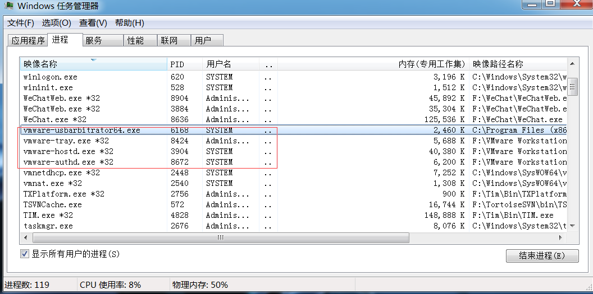
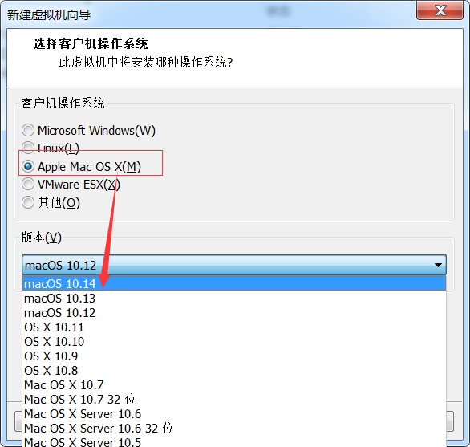
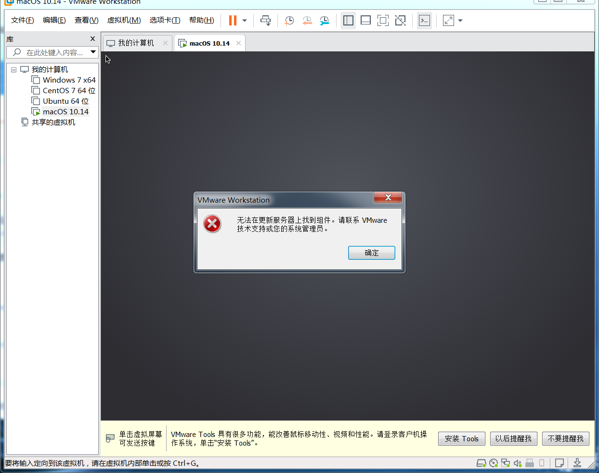
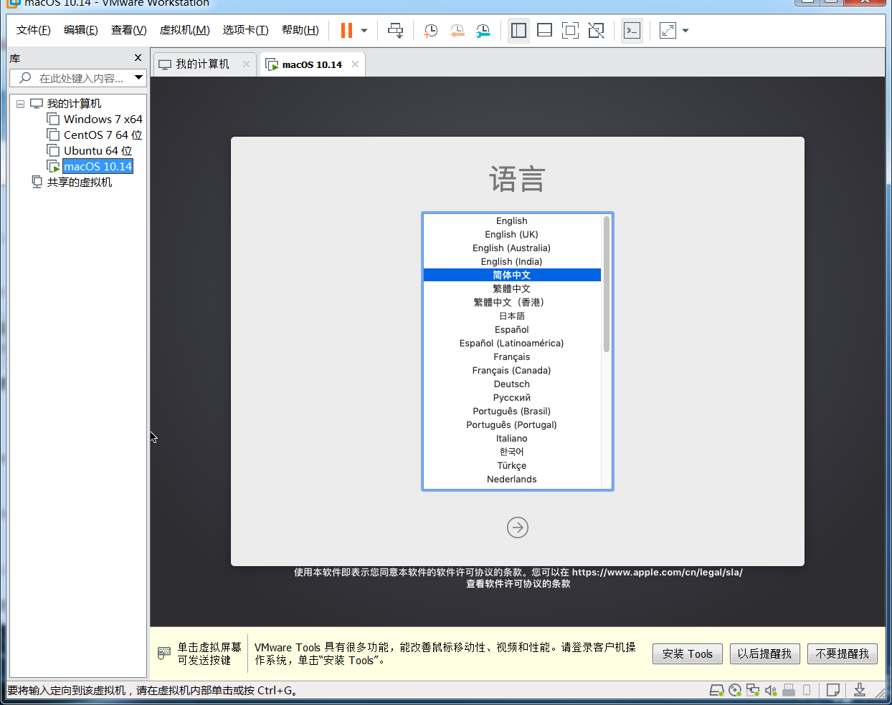
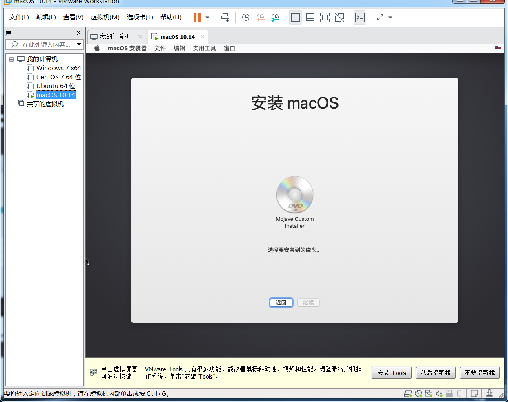
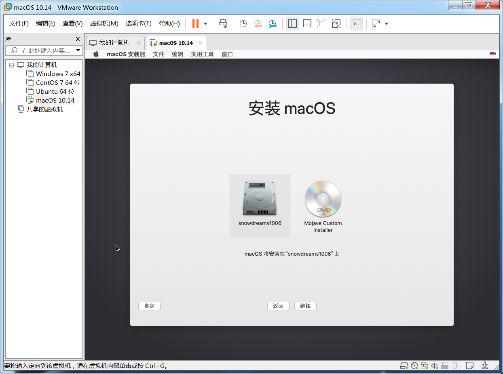
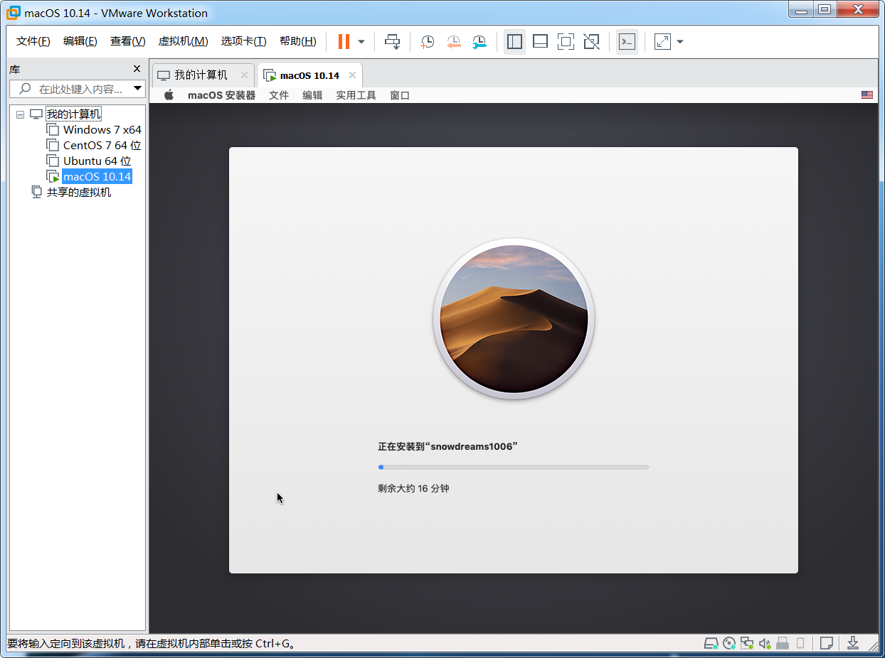
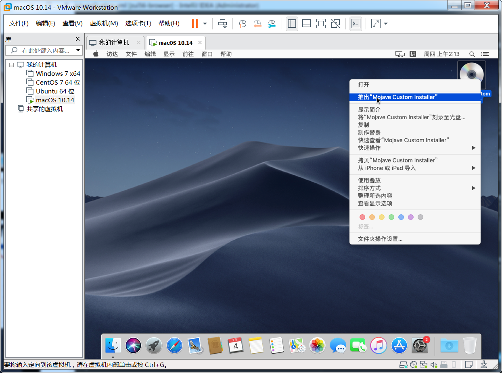
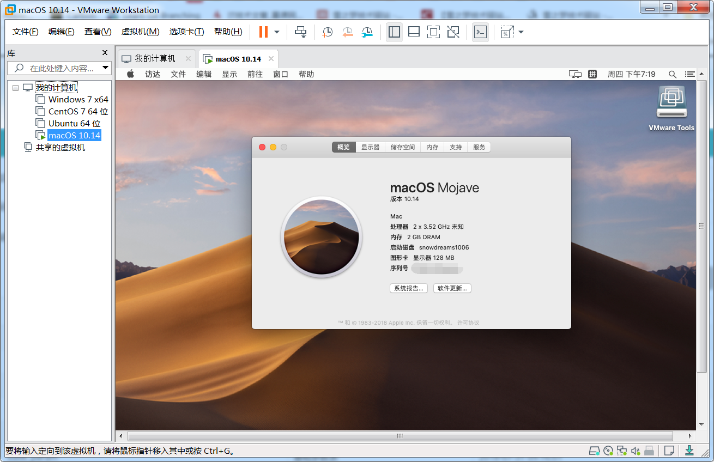

# 给 windows 虚拟机装个 mac

众说周知,`Mac` 很好但也很贵,对一般大众而言,漂亮简洁高颜值,对软件开发者而言,方便省心有点贵.

- 好到什么程度?

内置大量常用的开发工具,省去了初学者安装配置环境的麻烦,版本控制工具 `svn` 默认已安装,`web` 服务器 `apache` 默认已安装,编程开发环境 `php` 默认已安装等等,例子很多就不一一列举了.
除此之外,`Mac` 系统不同于 `Windows` 系统,`Mac` 系统是一种类 `Unix` 操作系统,命令行工具很好用,相当于提前熟悉 `Linux` 语法了,这一点是 `Windows` 望尘莫及的.

- 贵到什么程度?

随随便便的普通版七八千,如果再稍微挑挑拣拣,起码一两万!

如果预算不够但又想体验一下 `Mac` 电脑,该怎么办?

答案很简单,直线去去线下苹果体验店啊! 

哈哈,我是开玩笑的,言归正传,买不起真实的苹果笔记本也没关系,我们可以像安装普通软件那样,安装一个苹果笔记本!

下面我们将介绍一种方法,让你能够在 `Windows` 电脑上安装一个苹果笔记本,用起来和真的一样,只不过你我都心知肚明,那并不是真实的机器!

## 知识扫盲

- **虚拟机**是相对于真实的物理机而言的概念,是在我们当前正在使用的计算机基础上,通过软件或硬件的方式创造的新的计算机.

- `VMware` 是常用的虚拟机软件之一,物理机安装好 `VMware` 软件就可以利用该软件虚拟出任意计算机即虚拟机.

`VMware` 支持 `Windows` ,`Mac` 和 `Linux` 等常见操作系统,是名副其实的跨平台软件.

- **镜像** 是一种特殊格式的文件,文件后缀名一般是 `.iso` ,但也要例外,比如本文安装的 `macOS Mojave 10.14 18A391 Lazy Installer(MD5-CDD5EDA714D8BCC8E799F8272556CF3B).cdr` 的后缀名却是 `.cdr` ,镜像文件就是创建虚拟机的必要程序,有了它 `VMware` 软件才能创建出虚拟机.

总的来说,`VMware` 软件加载 `xxos.iso` 镜像文件创建出 `xxos` 虚拟机.

所以,阅读教程前请务必准备好 `VMware` 虚拟机以及相应的镜像文件.

## 安装准备

虚拟机技术能够虚拟出任何操作系统,并不局限于 `Windows` 安装 `Mac` ,也可以安装 `Linux` 或者 `Windows` .
同理,虚拟机技术也不局限于 `VMware` ,也可以是 `VirtualBox` 或者 `Parallels Desktop` 等等.

为了避免选择困难症,下面以 `VMware` 虚拟机安装 `Mac` 为例,简单演示一下安装流程.

安装 `Mac` 操作系统需要两个前提条件:

- `Windows` 电脑已安装好 `VMware` 虚拟机.
- `Windows` 电脑已下载好 `Mac` 操作系统镜像.

> 链接: `https://pan.baidu.com/s/1zL7-nB7ukif6nWBQ8KyOMA` 提取码: `hrgr` 

- [给 windows 装个 vmware 虚拟机](https://mp.weixin.qq.com/s/7_ZxBsxlMoCIr-Qcw1G8Qg)
- [给 mac 装个 vmware 虚拟机](https://mp.weixin.qq.com/s/ToXjx06xlehHpsCcfOWliw)

> 如果尚未安装 `VMware` 虚拟机,请参考上述链接进行安装,如果链接已失效,请私信我补发. 

- `macOS Unlocker for VMware v3.0.2.zip` 解锁文件,是安装镜像文件的前提.
- `macOS Mojave 10.14 18A391 Lazy Installer(MD5-CDD5EDA714D8BCC8E799F8272556CF3B).cdr` 镜像文件,是安装 `Mac` 操作系统的灵魂.

> 友情提示,百度云下载大文件限速太厉害,一定要准备好下载方案或者开通超级VIP进行下载.

## 安装镜像

### 解锁镜像

打开 `VMware` 软件,选择 `文件-> 创建新的虚拟机` 或者在主页中选择 `创建新的虚拟机` .

选择已下载好的镜像文件,选择文件时默认后缀名是 `.iso` 而我们安装的镜像文件是 `.cdr` ,因此一定要选择**全部**文件,这样就能选中 `macOS Mojave 10.14 18A391 Lazy Installer(MD5-CDD5EDA714D8BCC8E799F8272556CF3B).cdr` 镜像文件了!

虽然已经加载镜像文件,但是存在警告信息: 无法检测此光盘镜像中的操作系统. 无关紧要,下一步手动指定安装的镜像文件是 `Mac 10.14` 操作系统即可!

当我们理所当然点击下一步时,顿时傻眼了,竟然没有 `Mac os` 操作系统,凭什么?!

客户机操作系统选项没有 `Mac` 操作系统是不是因为上一步的警告信息呢?还真不是,因为并没有解锁!

解压 `macOS Unlocker for VMware v3.0.2.zip` 并找到 `win-install.cmd` 文件,选中该文件右键以管理员身份运行!

> 测试时运行效果是一闪而过,应该也无碍,只要再次安装镜像时出现 `Mac Os` 操作系统就是解锁成功.

如果没有解锁成功,打开 **windows 任务管理器** 并杀死 `vmware` 相关的全部进程,再次运行`win-install.cmd` 命令.

### 继续安装

解锁成功后,再次打开 `VMware` 软件继续安装镜像文件,此时已经出现 `Mac os` 操作系统选项了,如果没有出现该选项,请返回上一步.

接下来正常安装,傻瓜式操作均采用默认配置,直接点击下一步,直到安装完成.

> 安装虚拟机后,有啥秘密试验都可以在虚拟机上进行操作啦,再也不担心会不小心损坏物理机了呢!

## 开机体验

虚拟机安装完毕后,选择启动该虚拟机,正如物理机按开机按键一样,静静等待传说中的黑苹果!

安装一会接着提示"无法在更新服务器上找到组件",这是因为网络不通或者破解软件的原因,可以暂时忽略该错误.

设置语言,使劲往下滑直到最后,然后选择简体中文,紧接着下一步.

开始安装 `macOS` 操作系统,选择"继续". 

同意协议并继续下一步.

不好意思,我又指了一条错误的安装道路!

下一步无路可走,只好返回,现在又回到准备安装的界面,看来我们必须准备好安装磁盘才能继续!

选择 `实用工具->磁盘工具` 开始准备安装磁盘.

打开的新页面左侧有两块磁盘,选择下面以 `VMWare` 开头的磁盘,编辑好**磁盘名称**(如 `snowdreams1006`),然后点击**抹掉**.

完成后关闭当前页面并返回到开始安装页面,紧接着继续下一步直到上次停留的页面.

现在已经出现了安装磁盘,选择刚刚命名的 `snowdreams1006` 安装磁盘,继续愉快的下一步!

虽然说还剩 `16min` ,实测感觉要长多了,幸运的是,接下来的安装步骤没有特别需要注意点,因此整理成动图略过.

终于安装完毕,退出安装光盘,大功告成!

并不是所有的安装版本都是最新版,当初的最新版也不一定是现在的最初版,如果追求最新操作系统,那你可以手动升级啊!

## 安装总结

`VMware` 软件提供了虚拟机环境,差一个操作系统就能创建出虚拟机,而这种操作系统大部分是 `.iso`镜像文件.

镜像文件基本上至少 `3g` ,下载镜像文件也比较耗时,可以利用专业第三方下载工具进行下载.

虚拟机配置比较简单,采用推荐的默认值进行设置即可,除非你有特殊需求或者明白你正在设置的选项含义,否则不要随意更改推荐设置.

安装虚拟机中途可能会多次重启虚拟机,请耐心等待,不要中断安装操作,完成后自会完成!

- [工具资源系列之给windows装个虚拟机](https://mp.weixin.qq.com/s/7_ZxBsxlMoCIr-Qcw1G8Qg)
- [工具资源系列之给mac装个虚拟机](https://mp.weixin.qq.com/s/ToXjx06xlehHpsCcfOWliw)
- [工具资源系列之给mac虚拟机装个windows](https://mp.weixin.qq.com/s/FBuOI_LIm-o1lbKuSaTakw)

> 如果觉得本文写的不错,欢迎点赞留言和转发哟!

