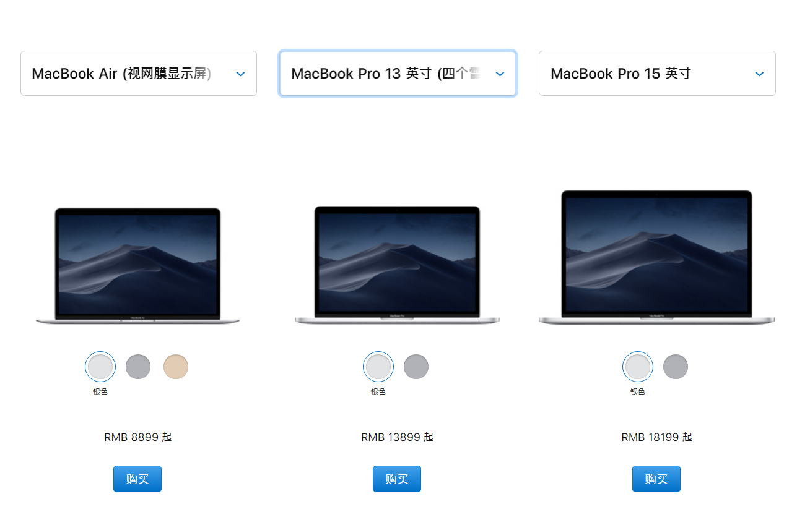
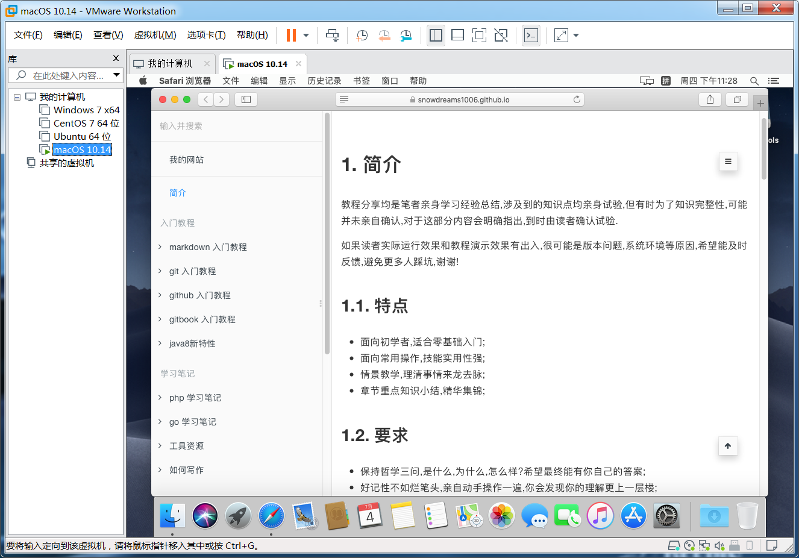
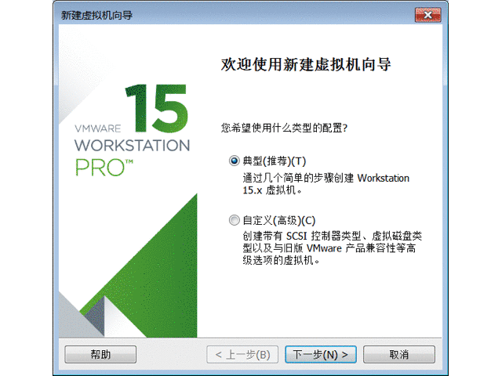
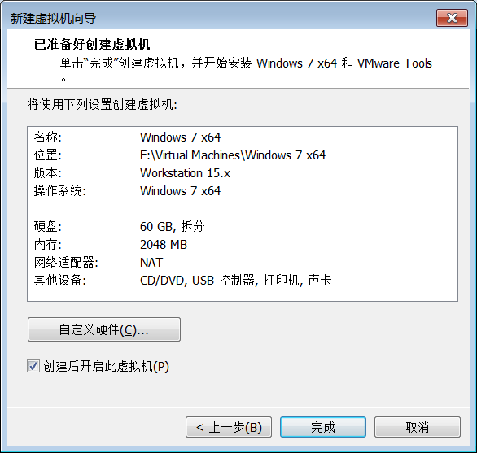

# 给 windows 虚拟机装个 mac


众说周知,`Mac` 很好但也很贵,对一般大众而言,漂亮简洁高颜值,对软件开发者而言,方便省心有点贵.

- 好到什么程度?

内置大量常用的开发工具,省去了初学者安装配置环境的麻烦,版本控制工具 `svn` 默认已安装,`web` 服务器 `apache` 默认已安装,编程开发环境 `php` 默认已安装等等,例子很多就不一一列举了.
除此之外,`Mac` 系统不同于 `Windows` 系统,`Mac` 系统是一种类 `Unix` 操作系统,命令行工具很好用,相当于提前熟悉 `Linux` 语法了,这一点是 `Windows` 望尘莫及的.

- 贵到什么程度?

随随便便的普通版七八千,如果再稍微挑挑拣拣,起码一两万!



如果预算不够但又想体验一下 `Mac` 电脑,该怎么办?

答案很简单,直线去去线下苹果体验店啊! 


开玩笑,

对于预算不够又想要体验macOS，或者正在犹豫要不要入MacBook的小伙伴来说，黑苹果无疑是最简单的办法，对于大部分小白来说，直接在主机上安装黑苹果是一种极其费事的操作，因为每种型号的电脑所需要的文件都不太一样，无形中增加了很多难度。


前面我们已经介绍了如何在 `Windows` 宿主机安装 `VMware` 虚拟机,这节我们将利用安装好的 `VMware` 软件安装 `Mac` 系统.



## 前情回顾

虚拟机是相对于真实的物理机而言的概念,是在我们当前正在使用的计算机基础上,通过软件或硬件的方式创造的新的计算机.

本文主要介绍的是 `VMware` 虚拟机,下载并安装 `VMware` 软件再安装操作系统即可模拟出另一台计算机的效果,这种模拟出来的计算机就是虚拟机.

`VMware` 不仅支持 `Windows` 也支持 `Linux` ,对于 `Mac` 系统也是支持的,如需了解 `Mac` 宿主机如何安装使用虚拟机,可以参考[工具资源系列之给mac装个虚拟机](https://mp.weixin.qq.com/s/ToXjx06xlehHpsCcfOWliw).

> `Windows` 物理机如何安装虚拟机请参考 [给 windows 装个 vmware 虚拟机](https://mp.weixin.qq.com/s/7_ZxBsxlMoCIr-Qcw1G8Qg)

## 下载镜像

`VMware` 为我们安装虚拟机提供了环境,真正的虚拟机到底是 `Windows` 系统还是 `Linux` 系统取决于我们要安装什么操作系统.

安装操作系统最简单便捷的方式就是下载操作系统的镜像文件,`VMware` 识别到镜像文件后就会一步一步安装操作系统.

所以我们第一步要做的就是寻找镜像文件,正所谓"知自知彼方能百战不殆",意味着首先要确定下我们到底要安装哪一个版本的操作系统?

`Windows` 操作系统有很多种,有 `Win7` ,`Win8` 和 `Win10` ,还有旗舰版和家庭版.

如果我们购买真实的计算机,那肯定要好好考虑一下,毕竟金钱要花的有价值,然而我们要安装的虚拟机,并不收费,这么多版本我们可以任意挑选安装!

如果有明确的目标,可以按照实际需求自行下载相应的操作系统;
如果没有明确的目标,不妨和我一样安装一个和本机相似的虚拟机,一来操作比较熟悉,而来可以在虚拟机进行任意实验.

所以,首先我要看一下本机的系统版本,因此我决定安装同款 `Win7` 旗舰版!


> 选择 `我的电脑 > 右键属性 > 查看计算机的相关属性` ,我的电脑是 `Windows 7 旗舰版`

现在已经明确了虚拟机的操作系统,那我们去哪里下载目标虚拟机的镜像文件呢?

这里推荐一下 [https://msdn.itellyou.cn/](https://msdn.itellyou.cn/) 网站,方便使用,好评!


- `Windows 7 Enterprise (x64) - DVD (Chinese-Simplified)` : 64 位企业版
- `Windows 7 Enterprise (x86) - DVD (Chinese-Simplified)` : 32 位企业版
- `Windows 7 Enterprise with Service Pack 1 (x64) - DVD (Chinese-Simplified) ` : 64 位企业版且带有`service package 1`
- `Windows 7 Enterprise with Service Pack 1 (x86) - DVD (Chinese-Simplified)` : 32 位企业版且带有`service package 1`
- `Windows 7 Home Basic (x86) - DVD (Chinese-Simplified)` : 32 位家庭普通版
- `Windows 7 Home Basic with Service Pack 1 (x86) - DVD (Chinese-Simplified)` : 32 位家庭普通版且带有`service package 1`
- `Windows 7 Home Premium (x64) - DVD (Chinese-Simplified)` : 64 位家庭高级版
- `Windows 7 Home Premium (x86) - DVD (Chinese-Simplified)` : 32 位家庭高级版
- `Windows 7 Home Premium with Service Pack 1 (x64) - DVD (Chinese-Simplified)` : 64 位家庭高级版且带有`service package 1`
- `Windows 7 Home Premium with Service Pack 1 (x86) - DVD (Chinese-Simplified)` : 32 位家庭高级版且带有`service package 1`
- `Windows 7 Professional (x64) - DVD (Chinese-Simplified)` : 64 位专业版
- `Windows 7 Professional (x86) - DVD (Chinese-Simplified)` : 32 位专业版
- `Windows 7 Professional with Service Pack 1 (x64) - DVD (Chinese-Simplified)` : 64 位专业版且带有`service package 1` 
- `Windows 7 Professional with Service Pack 1 (x86) - DVD (Chinese-Simplified)` : 32 位专业版且带有`service package 1` 
- `Windows 7 Professional with Service Pack 1, VL Build (x64) - DVD (Chinese-Simplified)` : 64 位专业版且带有`service package 1`,并基于 `VL` 进行构建.
- `Windows 7 Professional with Service Pack 1, VL Build (x86) - DVD (Chinese-Simplified)` : 32 位专业版且带有`service package 1`,并基于 `VL` 进行构建.
- `Windows 7 Professional, VL Build (x64) - DVD (Chinese-Simplified)` : 64 位专业版并基于 `VL` 进行构建.
- `Windows 7 Professional, VL Build (x86) - DVD (Chinese-Simplified)` : 32 位专业版并基于 `VL` 进行构建.
- `Windows 7 Starter (x86) - DVD (Chinese-Simplified)` : 32 位初级版
- `Windows 7 Starter with Service Pack 1 (x86) - DVD (Chinese-Simplified)` : 32 位初级版且带有`service package 1`
- `Windows 7 Ultimate (x64) - DVD (Chinese-Simplified)` : 64 位旗舰版
- `Windows 7 Ultimate (x86) - DVD (Chinese-Simplified)` : 32 位旗舰版
- `Windows 7 Ultimate with Service Pack 1 (x64) - DVD (Chinese-Simplified)` : 64 位旗舰版且带有`service package 1` 
- `Windows 7 Ultimate with Service Pack 1 (x86) - DVD (Chinese-Simplified)` : 32 位旗舰版且带有`service package 1` 
- `Windows Automated Installation Kit for Windows 7 and Windows Server 2008 R2 (x86, x64, ia64) - DVD (Chinese-Simplified)` : `Windows 7 and Windows Server 2008 R2 (x86, x64, ia64)` 自动安装包套件
- `Windows Automated Installation Kit for Windows 7 and Windows Server 2008 R2 Service Pack 1 (x86, x64, ia64) - DVD (Chinese-Simplified)` : `Windows 7 and Windows Server 2008 R2 Service Pack 1 (x86, x64, ia64)` 自动安装包套件

上述这么多的版本是不是让人有些眼花缭乱,具体版本之间有何差异以及自己适合哪一种请百度一下再理性分析!

以下以 64 位旗舰版且带有服务包操作系统为例进行演示,主要是创建一个和宿主机一样的操作环境,方便后续进行秘密实验!

> `cn_windows_7_ultimate_with_sp1_x64_dvd_u_677408.iso` 镜像文件,其中 `cn` 表示中文简体语言, `Windows_7` 表示 `Win7` 操作系统, `ultimate` 表示旗舰版,`sp1` 表示`service package 1` ,`x64` 表示 64 位操作系统,`dvd` 表示 `DVD` 安装方式,`677408` 应该是版本号,`.iso` 是镜像文件的后缀.

```
ed2k://|file|cn_windows_7_ultimate_with_sp1_x64_dvd_u_677408.iso|3420557312|B58548681854236C7939003B583A8078|/
```

由于镜像文件本身比较大,因此推荐使用专业的下载工具进行,这里使用的是**迅雷**下载**磁力链接**.


> 镜像文件: `cn_windows_7_ultimate_with_sp1_x64_dvd_u_677408.iso` ,其中后缀是 `.iso` ,千万**不要解压**! **不要解压**! **不要解压**!

## 安装镜像

> 准备好已下载的镜像文件: `cn_windows_7_ultimate_x64_dvd_x15-66043.iso` 

打开 `VMware` 软件,选择 `文件-> 创建新的虚拟机` 或者在主页中选择 `创建新的虚拟机` .


总体来说,安装过程比较简单,前面相关配置按照默认值即可,后面真正安装过程可能耗费时间比较长,耐心等待安装完成.



`VMware` 仅能识别出镜像文件基本信息,具体版本信息还是需要手动校准,下载的镜像文件是 `Win7 旗舰版` ,因此安装版本也是 `Win7 旗舰版` .


一系列安装配置完毕后,还有最后一步配置确认操作,确认无误后点击 `完成` 就可以真正进行安装虚拟机了!



安装过程中可能要求输入产品密钥以及设置用户,这些操作和新买计算机刚开机时操作一模一样,百度找一下相应版本的产品密钥即可,可以设置登录用户也可以不设置用户.

至此,安装成功!


> 安装虚拟机后,有啥秘密试验都可以在虚拟机上进行操作啦,再也不担心会不小心损坏物理机了呢!

## 回忆总结

`VMware` 软件提供了虚拟机环境,差一个操作系统就能创建出虚拟机,而这种操作系统大部分是 `.iso`镜像文件.

镜像文件基本上至少 `3g` ,下载镜像文件也比较耗时,可以利用专业第三方下载工具进行下载.

虚拟机配置比较简单,采用推荐的默认值进行设置即可,除非你有特殊需求或者明白你正在设置的选项含义,否则不要随意更改推荐设置.

安装虚拟机中途可能会多次重启虚拟机,请耐心等待,不要中断安装操作,完成后自会完成!

- [工具资源系列之给windows装个虚拟机](https://mp.weixin.qq.com/s/7_ZxBsxlMoCIr-Qcw1G8Qg)
- [工具资源系列之给mac装个虚拟机](https://mp.weixin.qq.com/s/ToXjx06xlehHpsCcfOWliw)
- [工具资源系列之给mac虚拟机装个windows](https://mp.weixin.qq.com/s/FBuOI_LIm-o1lbKuSaTakw)

> 如果觉得本文写的不错,欢迎点赞留言和转发哟!

