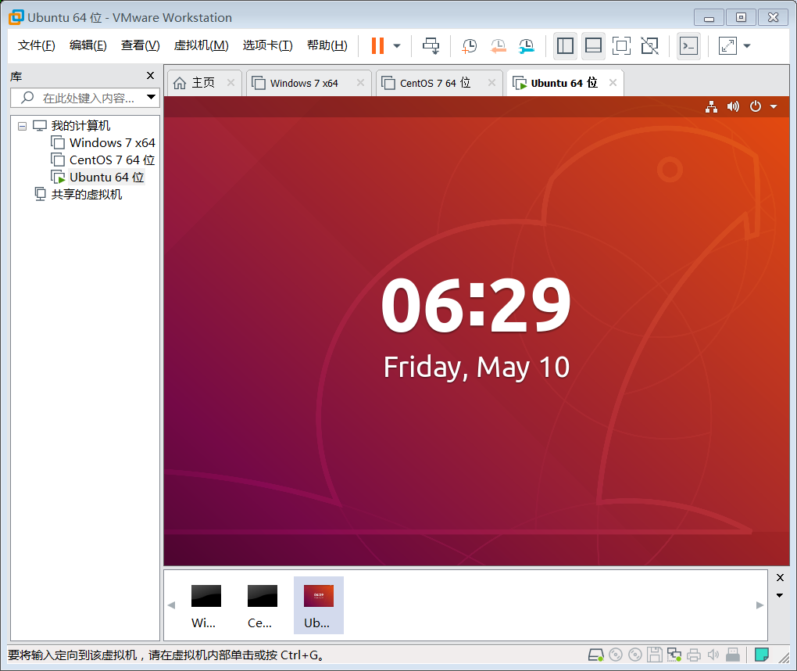
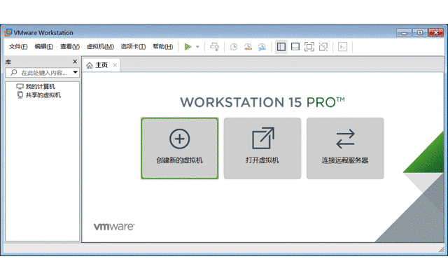
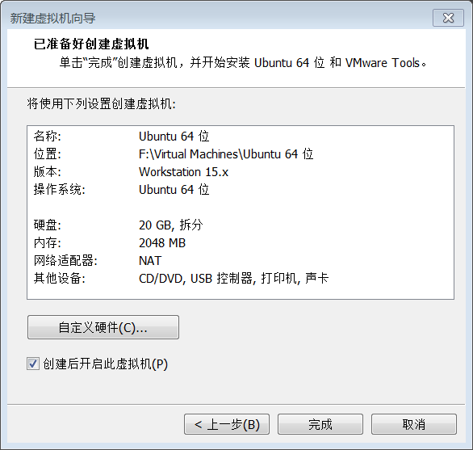
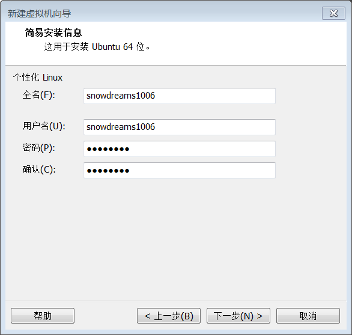
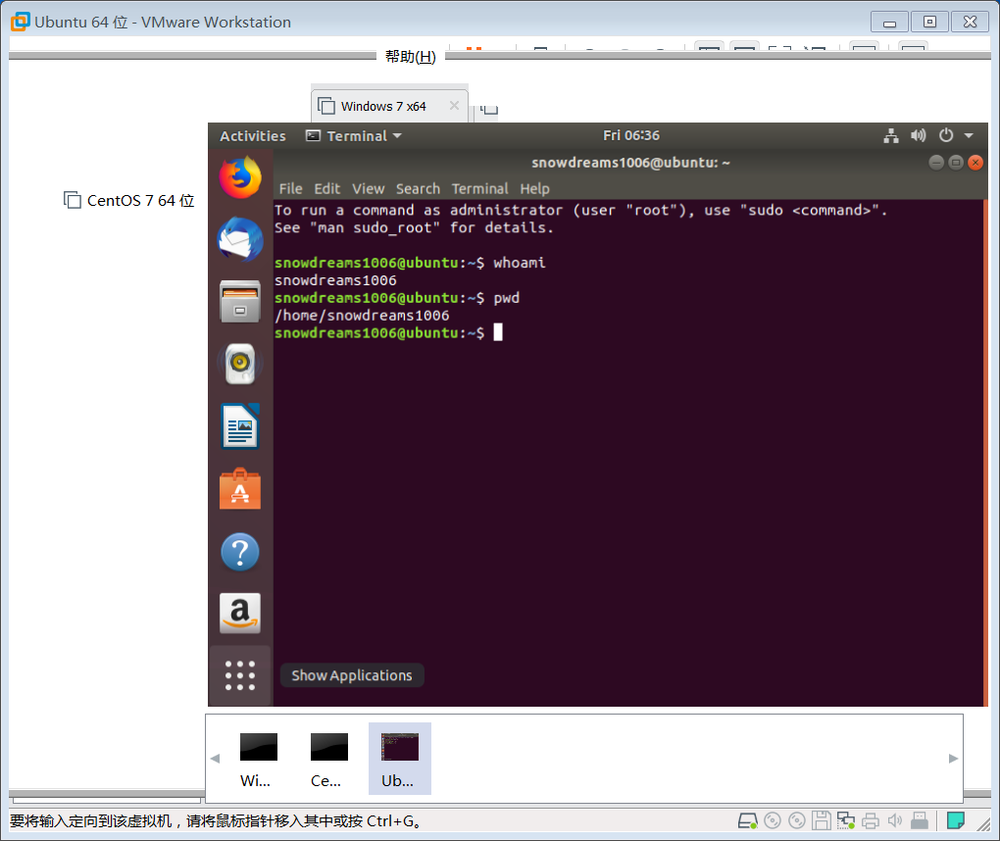

# 给 windows 虚拟机装个 ubuntu

前面我们已经介绍了如何在 `Windows` 宿主机安装 `VMware` 虚拟机,这节我们将利用安装好的 `VMware` 软件安装 `Ubuntu` 系统.

## 前情回顾

虚拟机为我们在 `Windows` 宿主机体验别的系统提供了可能,虚拟机的强大之处在于我们可以自由安装任意操作系统,不管是同款 `Windows` 还是 `Linux` 都可以!

关于如何安装 `VMware` 软件可以参考上一篇文章,这里给出 `Windows` 和 `Mac` 的安装教程.

- [给 windows 装个 vmware 虚拟机](https://mp.weixin.qq.com/s/7_ZxBsxlMoCIr-Qcw1G8Qg)
- [给 mac 装个 vmware 虚拟机](https://mp.weixin.qq.com/s/ToXjx06xlehHpsCcfOWliw)

## 下载镜像

> [Ubuntu 操作系统下载](https://www.ubuntu.com/download): https://www.ubuntu.com/download

这里我们选择桌面版(Ubuntu Desktop),接着选择 `LTS` 长期支持版进行下载安装.

按照实际需要选择适合自己的操作系统,这里选择的是 `Ubuntu18 LTS` ,然后选择下载.

> 镜像文件: `ubuntu-18.04.2-desktop-amd64.iso` ,其中后缀是 `.iso` ,千万**不要解压**! **不要解压**! **不要解压**!

## 安装镜像

> 准备好已下载的镜像文件: `ubuntu-18.04.2-desktop-amd64.iso` 

打开 `VMware` 软件,选择 `文件-> 创建新的虚拟机` 或者在主页中选择 `创建新的虚拟机` .

总体来说,安装过程比较简单,前面相关配置按照默认值即可,后面真正安装过程可能耗费时间比较长,耐心等待安装完成.

一系列安装配置完毕后,还有最后一步配置确认操作,确认无误后点击 `完成` 就可以真正进行安装虚拟机了!

安装过程中需要添加用户,用于安装完毕后登陆系统.

至此,安装成功!

> 安装虚拟机后,有啥秘密试验都可以在虚拟机上进行操作啦,再也不担心会不小心损坏物理机了呢!

## 回忆总结

`VMware` 虚拟机配置比较简单,安装 `Ubuntu` 镜像文件时耗费时间相当长,慢慢等待一切会自动安装好的.

安装虚拟机过程可能会重启虚拟机,请耐心等待,不要中断安装操作,完成后自会完成!

- [工具资源系列之给windows装个虚拟机](https://mp.weixin.qq.com/s/7_ZxBsxlMoCIr-Qcw1G8Qg)
- [工具资源系列之给mac装个虚拟机](https://mp.weixin.qq.com/s/ToXjx06xlehHpsCcfOWliw)
- [工具资源系列之给虚拟机装个ubuntu](https://mp.weixin.qq.com/s/SOXDe_MECBCr_shzS3buMA)

> 如果觉得本文写的不错,欢迎点赞留言和转发哟!