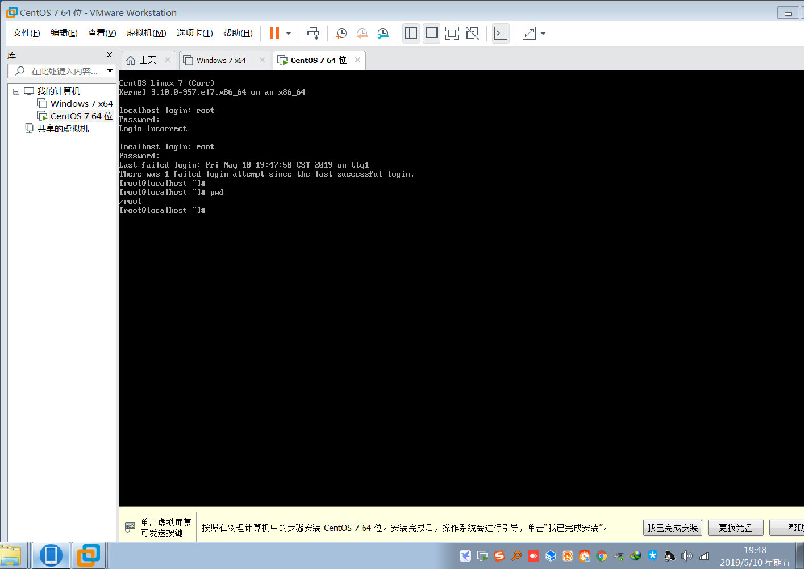
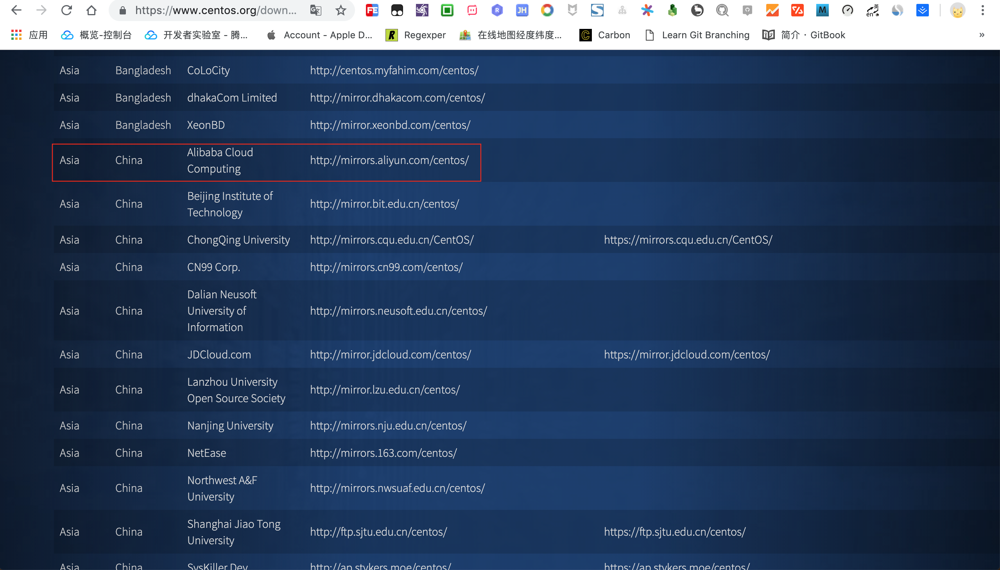
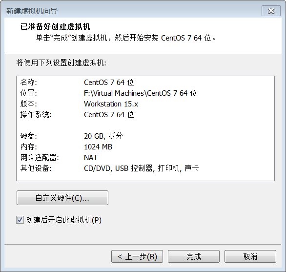
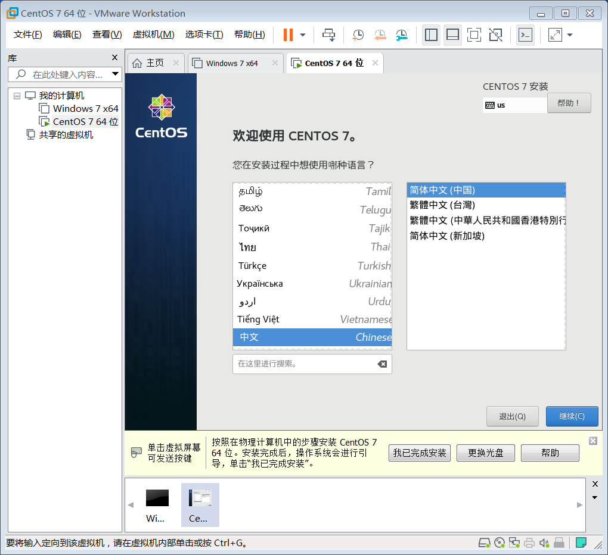
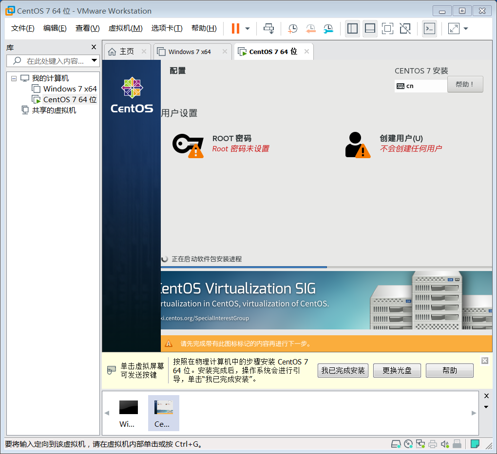
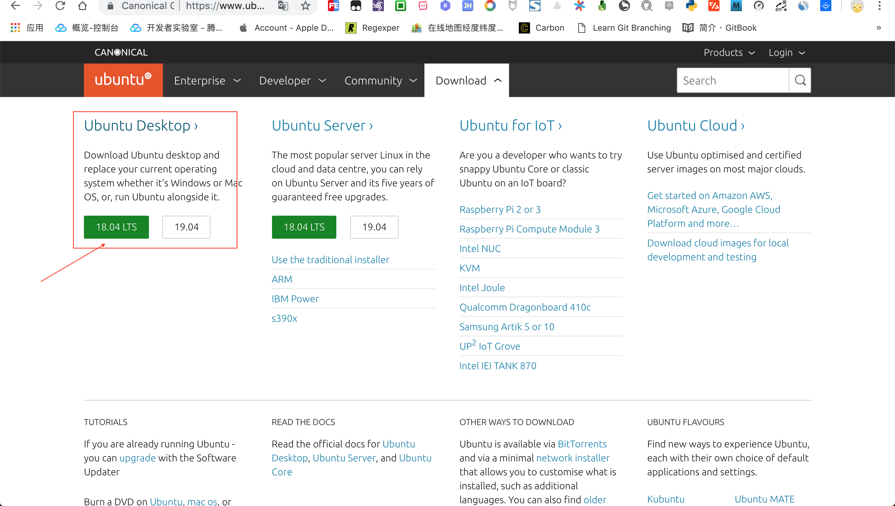
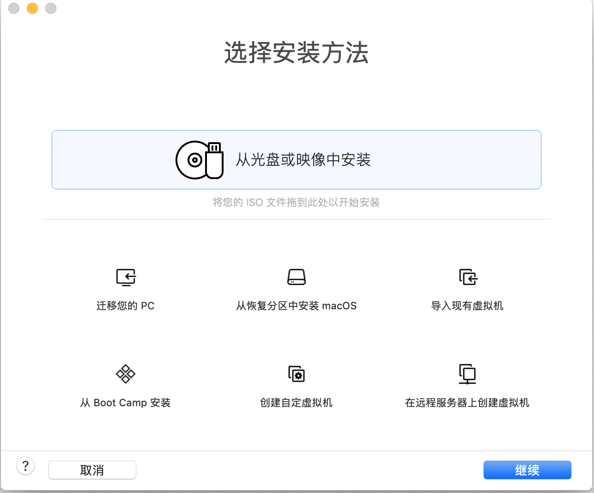

# 给 windows 虚拟机装个 ubantu

前面我们已经介绍了如何在 `Windows` 宿主机安装 `VMware` 虚拟机,这节我们将利用安装好的 `VMware` 软件安装 `centos` 系统.

## 前情回顾

由于大多数人使用的 `Windows` 电脑而工作中可能需要一台 `centos` 电脑,如果条件允许的话,一般公司会有相应的测试服务器.

但是,如果是个人使用的话,公司的测试服务器就不能轻易做各种实验了,毕竟测试服务器是大家公用的,万一不小心搞坏了影响了他人的使用就不好交代了.

因此,最好能够有一台私有的 `centos` 计算机,可以随意鼓捣还不用担心影响到其他人,这种情况下虚拟机提供了很好的解决思路.

虚拟机是相对宿主机而言较为独立的计算机,即使不小心把虚拟机搞崩了也不要紧,重新装下虚拟机就好了,也不会损坏真实的宿主机.

而我们介绍的虚拟机软件是 `VMware` ,跨平台支持三大主流操作系统,因此无论是 `Windows` 还是 `Mac` 或者 `Linux` 系统都可以借壳生蛋,继续创造出不同的操作系统.

- [给 windows 装个 vmware 虚拟机](https://mp.weixin.qq.com/s/7_ZxBsxlMoCIr-Qcw1G8Qg)
- [给 mac 装个 vmware 虚拟机](https://mp.weixin.qq.com/s/ToXjx06xlehHpsCcfOWliw)

## 下载镜像

> [centos 操作系统下载](https://www.centos.org/download/): https://www.centos.org/download/

安装 `centos` 操作系统需要镜像文件,寻找镜像文件最简单的方法是 `centos` 自己的官网,因此我们直接去官方看一下吧!

这里提供了 `DVD ISO` 和 `Minimal ISO` 两种类型,普通用户推荐选择前一种标准版,开发用户建议选择后一种最小版.

> 标准版功能比较齐全,最小版保证最小依赖,后续缺啥填啥,比较灵活节省空间内存.

按照实际需要选择适合自己的操作系统,这里选择的是 `centos7.6` ,然后选择合适的下载方式(直接下载或下载种子链接).

建议选择镜像服务器下载,如果直接下载官网的地址,速度感人,时间有点长.

> 依次选择 `list of current mirrors -> http://mirrors.aliyun.com/centos/ -> 7.6.1810/ -> isos/ -> x86_64/  -> CentOS-7-x86_64-Minimal-1810.iso` 选择合适的版本点击下载.

> 镜像文件: `CentOS-7-x86_64-Minimal-1810.iso` ,其中后缀是 `.iso` ,千万**不要解压**! **不要解压**! **不要解压**!

## 安装镜像

> 准备好已下载的镜像文件: `CentOS-7-x86_64-Minimal-1810.iso` 

打开 `VMware` 软件,选择 `文件-> 创建新的虚拟机` 或者在主页中选择 `创建新的虚拟机` .

总体来说,安装过程比较简单,前面相关配置按照默认值即可,后面真正安装过程可能耗费时间比较长,耐心等待安装完成.

一系列安装配置完毕后,还有最后一步配置确认操作,确认无误后点击 `完成` 就可以真正进行安装虚拟机了!

安装过程中配置语言,默认是英语,中文简体在最下面,一直往下翻选择简体中文即可.

设置超级管理员密码以及添加用户,用于安装完毕后登陆系统.

至此,安装成功!

> 安装虚拟机后,有啥秘密试验都可以在虚拟机上进行操作啦,再也不担心会不小心损坏物理机了呢!

## 回忆总结

`VMware` 软件提供了虚拟机环境,只要一个操作系统的镜像文件就能轻易创建出虚拟机,认准镜像文件的后缀名是 `.iso` .

`VMware` 虚拟机配置比较简单,基本上采用默认值进行设置即可,除非你有特殊需求或者明白你正在设置的选项含义,否则不要随意更改推荐设置.

安装虚拟机中途可能会多次重启虚拟机,请耐心等待,不要中断安装操作,完成后自会完成!

- [工具资源系列之给windows装个虚拟机](https://mp.weixin.qq.com/s/7_ZxBsxlMoCIr-Qcw1G8Qg)
- [工具资源系列之给mac装个虚拟机](https://mp.weixin.qq.com/s/ToXjx06xlehHpsCcfOWliw)
- [工具资源系列之给虚拟机装个centos](https://mp.weixin.qq.com/s/D1Fdpp2vcBnX0eVbMzPV1A)

> 如果觉得本文写的不错,欢迎点赞留言和转发哟!

前文我们已经讲解了如何在 `mac` 系统上安装虚拟机软件,这节我们接着讲解如何利用虚拟机安装 `Ubuntu` 镜像.

安装镜像的大致步骤基本相同,只不过是配置项略显不同而已,如果需要安装其他系统镜像,请参考另外两篇教程.

## 下载镜像

> [Ubuntu 操作系统下载](https://www.ubuntu.com/download): https://www.ubuntu.com/download

这里我们选择桌面版(Ubuntu Desktop),接着选择 `LTS` 长期支持版进行下载安装.

按照实际需要选择适合自己的操作系统,这里选择的是 `Ubuntu18 LTS` ,然后选择下载.

## 配置镜像

> 准备好已下载的镜像文件: `ubuntu-18.04.2-desktop-amd64.iso` 

打开 `VMware` 软件,选择 `文件->新建` 选项开始安装镜像文件.

弹出安装配置界面,选择 `从光盘或镜像中安装` 选项,然后将已下载的镜像文件拖动到安装区进行识别.

识别到镜像文件后选中该文件,点击 `继续` 准备下一步安装.

`linux` 快捷安装选项中配置用户信息,点击 `继续` .

确认配置信息无误后,点击 `完成` ,等待镜像安装...

## 安装镜像

只因在人群中看见了 `Ubuntu` ,便确定了你就是我要安装的操作系统.

惊鸿一瞥,容颜出现,安装进行时.

熟悉的命令行,成功只差一步.

现在输入之前配置的账号信息,开始登陆系统,见证奇迹的时刻即将来临...

终于等到你,还好我没放弃!

## 小结

总体来说,`mac` 系统安装 `Ubuntu` 镜像配置比较简单,基本上按照默认配置即可.

下载镜像时文件一般比较大,需要利用专门的第三方工具下载,既可以选择下载种子链接也可以直接下载.

