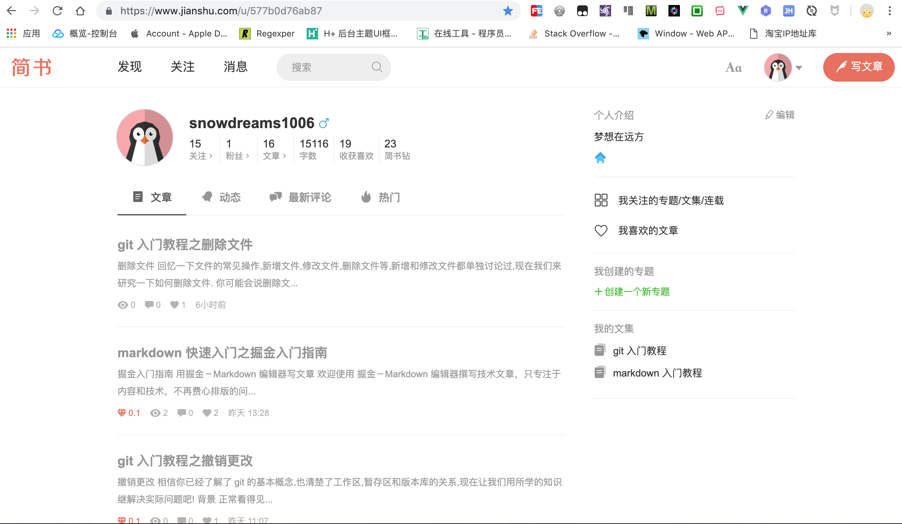
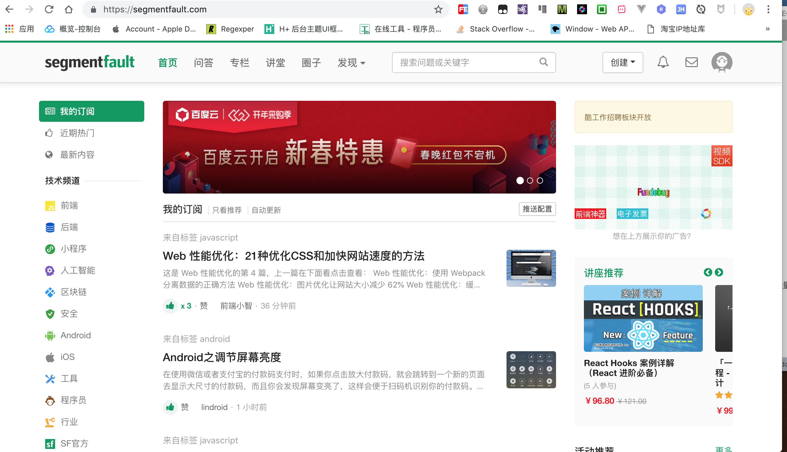
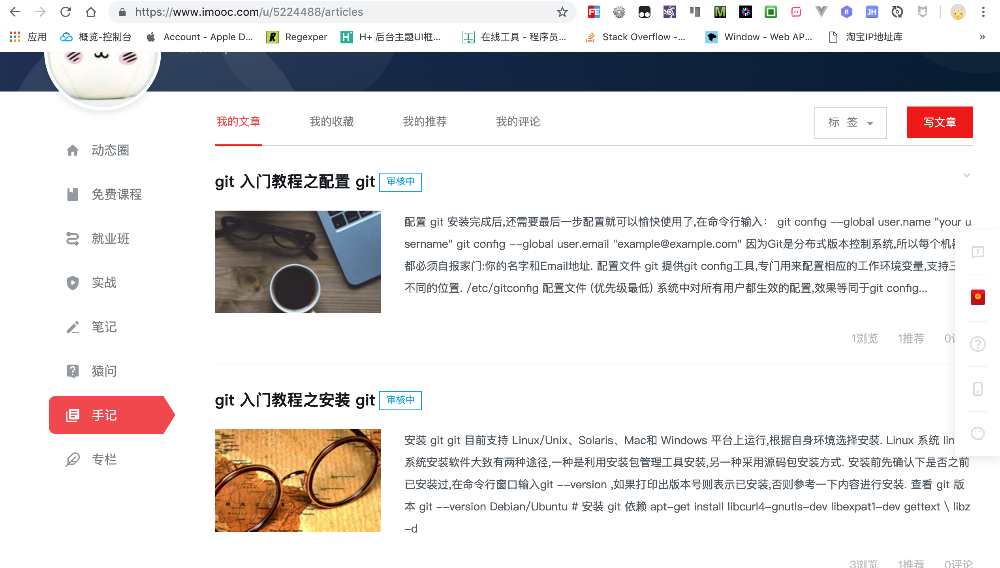
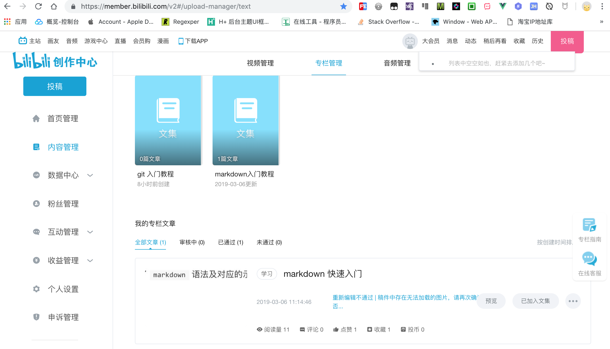

# 如何写作

越来越多的人想写个人博客或者打算做自媒体,笔者也是一样.
最近在学习如何写博客,分享下创作经历,避免走弯路.

首先在于定位,不同的定位决定了不同的平台.由于笔者分享的大多是技术类博客,所以主战场是各大主流的技术类博客论坛,当然还搭建了自己的官网.

考虑到前期仅仅是分享技术博客,无需购买专门的服务器,因此寻求免费的解决方案.
笔者采用的是 `github` 搭建个人项目官网,优点是不花一分钱,就能**免费**开启 `https` 服务,缺点是国内访问速度慢.

下面分为两部分介绍博客的创作平台,一部分是**个人官网**,另一部分是**第三方平台**.

## 个人官网

首先注册 `github` 账号(例如:用户名 `snowdreams1006`),然后新建特定规则的项目(例如:项目名 `snowdreams1006.github.io`),最后在项目下创建首页 `index.html` .现在访问 `https://用户名.github.io/`  ([https://snowdreams1006.github.io/](https://snowdreams1006.github.io/))即可.

个人官网的基本流程和特点如下:

1. 利用 `gitbook` 技术将 `markdown` 源码文件输出为 `html` 静态网页.
2. 将项目按照**特定规则**上传到 `github` 网站公开托管,生成免费网站.
3. 源代码更新后再生成输出文件,然后一起上传到 `github`,个人官网自动更新.

> 项目源码 [snowdreams1006.github.io](https://github.com/snowdreams1006/snowdreams1006.github.io),项目官网 [https://snowdreams1006.github.io/](https://snowdreams1006.github.io/)

## 第三方平台

### 1. CSDN [https://www.csdn.net/](https://www.csdn.net/)

`SEO` 优化不错,阅读量稳定,网页端阅读体验一般,手机端干净清爽,阅读量相对稳定.

不限制作者本人点赞,重复统计本人浏览记录,突出**阅读数**,其次是评论数和点赞数.

### 2. 博客园 [https://www.cnblogs.com/](https://www.cnblogs.com/)

`SEO` 优化不错,博客开通需审核,支持发布首页,但也可能因质量不达标而被移除.页面风格满满的时代感,目前暂无手机端.

限制作者本人推荐,不统计本人浏览记录,突出**推荐数**,其次是阅读量和评论数.

### 3. 开源中国 [https://www.oschina.net/](https://www.oschina.net/)

国内版 `github` ,高质量文章可能会被推荐至首页,否则阅读量几乎为零.

限制作者本人点赞,不统计本人浏览记录,突出**访问量**,其次评论数和点赞数.

### 4. 简书 [https://www.jianshu.com/](https://www.jianshu.com/)

文艺范的自媒体平台,简洁优美文艺性十足,`SEO` 优化不错,**日更活动**鼓励持续更新,**简书钻**和**简书贝**等虚拟货币增添写作乐趣!

限制作者本人点赞,不统计本人浏览记录,突出**简书钻**,其次阅读量,评论数和点赞数.

### 5. 思否 [https://segmentfault.com/](https://segmentfault.com/)

国内版`Stack OverFlow`,专注于**技术问答**,界面风格绿色清新,`SEO` 优化不错,但忽略阅读量.

限制作者本人点赞,不统计本人浏览记录,首次发布专栏需要审核,突出**投票数**,其次是收藏数,最后是阅读数.

### 6. 掘金 [https://juejin.im/timeline](https://juejin.im/timeline)

异军突起,风头正盛,时间流布局,**掘金小册子**是一大亮点,但`SEO` 很差!

不限制作者本人点赞,不重复统计本人浏览记录,突出**点赞数**,其次是评论数,最后是阅读量.

### 7. 慕课网手记 [https://www.imooc.com/article](https://www.imooc.com/article)

丰富的免费教学视频,正所谓"成也萧何败萧何",手记模块相比其他专业平台还有着不少的差距,`SEO` 一般.

文章需要审核,手记功能更像是配套教学视频而诞生的笔记,不太像专门博客.

### 8. 微信公众号 [https://mp.weixin.qq.com/](https://mp.weixin.qq.com/)

目前仅支持富文本编辑器,依靠粉丝流量,碎片化阅读体验,`SEO` 几乎没有.

需要花费精力运营公众号,限定当天阅读量和"在看"数,如果没有粉丝,那肯定没有阅读量.

### 9. B站专栏 [https://www.bilibili.com/](https://www.bilibili.com/)

弹幕视频网站,开通专栏投稿,目前仅支持富文本编辑器,不适合博客,`SEO` 可忽略.

适合视频教程,暂不适合博客且投稿专栏限制较多,毕竟不是专业做博客的平台,谁让我误入了呢!

## 总结

大多数平台都有阅读量,评论,点赞等维度数据统计,不同平台有着不同的推荐策略,优缺点如下:

- `csdn` : `SEO` 不错,阅读量稳定,适合新手积累信心.
- `博客园` : `SEO` 不错,阅读量有保障,适合新手提高自信.
- `开源中国` : `SEO` 一般,阅读量有挑战,适合优质文章博取官方推荐.
- `简书` : `SEO` 不错,阅读量很少,**日更活动**和**简书钻**奖励等形式鼓励持续创作,适合自我督促.
- `思否` : `SEO` 一般,阅读量一般,适合技术问答.
- `掘金` : `SEO` 很差,阅读量一般,适合优质文章.
- `慕课网手记` : `SEO` 一般,适合教学视频的配套笔记.
- `微信公众号` : `SEO` 很差,适合粉丝用户.
- `B站` : `SEO` 很差,适合教学视频.

从以上分析中可以看出,只要是**优质文章**无论到哪都受欢迎,然而"罗马并非一日建成",**优质文章**的诞生不在一朝一夕,所以新手期应该选择适合自己的平台发展,积累到一定程度后方能"春风得意马蹄疾,一日看遍长安花".

个人建议:

1. 选择**简书**平台,保持日更,同步到**CSDN**积累自信,推送到**博客园**,提高自信.
2. **官网**保持更新,运营**公众号**慢慢积累粉丝,最后再考虑**开源中国**,**掘金**和**思否**.

