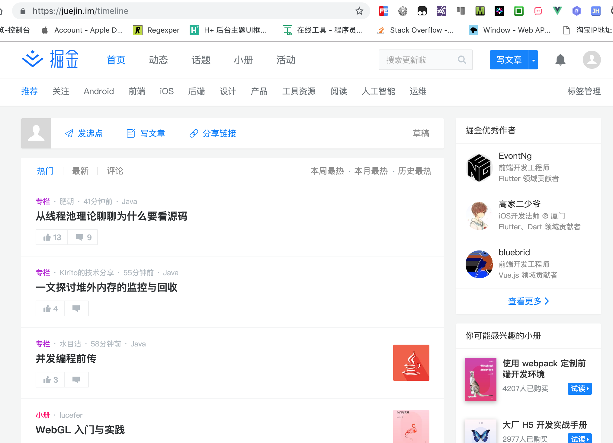

# 如何写作

越来越多的人想写个人博客,或者说做自媒体,笔者也是一样,最近也在开始学习如何写作,下面就浅谈一下个人经验.

由于笔者分享的大多是技术类博客,所以主战场当然是各大主流的技术类博客论坛以及自己的个人官网.

考虑到前期仅仅是分享博客,特意再购买服务器就有点小题大做了.如果是免费解决的问题
笔者采用的是利用 `github` 搭建个人官网,不花一分钱,就能**免费**开启 `https` 自定义域名,缺点就是国内访问速度有点慢.

## 个人官网

个人官网的操作流程如下:

1. 利用 `gitbook` 技术将 `markdown` 源码文件输出为 `html` 静态网页.
2. 将项目按照**特定规则**上传到 `github` 网站公开托管,生成免费网站.
3. 源代码更新后再生成输出文件,然后一起上传到 `github`,个人官网自动更新.

> 项目源码 [snowdreams1006.github.io](https://github.com/snowdreams1006/snowdreams1006.github.io),项目官网 [https://snowdreams1006.github.io/](https://snowdreams1006.github.io/)

## 第三方博客平台

### CSDN [https://www.csdn.net/](https://www.csdn.net/)

`csdn` 博客的 `seo` 做的不错,有自己的手机端 app,网页版阅读博客时有广告,一定程度上影响阅读体验.

#### 近期博客

不限制作者本人点赞和浏览,三天后阅读量基本上在60左右,手机端无广告,阅读体验很好.

#### 小结

配合手机端方便查看博客阅读量,阅读博客时无广告,逐步优化搜索引擎.

### 博客园 [https://www.cnblogs.com/](https://www.cnblogs.com/)

除了 `csdn` ,相信大家耳熟能详的就是 `博客园` 了吧! `seo` 做的也不错,也是数一数二的流量担当.
`博客园` 给人的第一印象就是年代久远,页面很复古有没有?遗憾的是,没有手机端,不能及时查看博客流量情况.

#### 近期博客

值得一提的是博客园的首页是一直有人在维护的,刚开始阅读量基本上15左右,上了首页之后阅读量基本上100左右,如果博客被移除首页的话,发邮件申诉下很快就能重回首页,限制本人推荐和浏览,总体来说,还是不错的!

#### 小结

作者本人不能推荐和浏览且首页有人维护,一定程度上保证了阅读量和优质文章,缺少手机端 app 不太方便.

### 开源中国 [https://www.oschina.net/](https://www.oschina.net/)

值得一说的是,是中国版的 `github`,文章如果被官方推荐了,阅读量会有保证,否则寥寥无几!

#### 近期博客

限制本人点赞和浏览,无缘首页,因此无人问津,权当一种渠道了.

#### 小结

没什么技术含量的文章或者同质化文章基本上不会被推荐首页的,没什么阅读量权当自娱自乐了!

### 简书 [https://www.jianshu.com/](https://www.jianshu.com/)

严格来讲,`简书` 并不是技术博客平台,更多的是自媒体平台,不过越来越多的程序员喜欢在 `简书` 上创作,也不失是一种选择.

#### 近期博客

`简书` 鼓励创作,**日更活动**更是吸引不少人持续更新,更有**简书钻**和**简书贝**等虚拟货币增添不少乐趣!
同样限制作者本人点赞和浏览,没人点赞的话,阅读量基本没有!

#### 小结

`简书` 的**日更计划**配合**简书钻**和**简书贝**等虚拟货币鼓励持续创作,即使初期没什么阅读量,坚持下去也能优化下搜索引擎!

### 思否 [https://segmentfault.com/](https://segmentfault.com/)

有人说,`segmentfault` 是中国版的 `StackOverFlow`,专注于**技术问答**社区.

#### 近期博客

作者本人限制推荐和浏览,首次发布专栏需要审核,阅读量基本上5个左右,强调点赞数量.

#### 小结

界面清新美观,值得写技术文章.

### 掘金 [https://juejin.im/timeline](https://juejin.im/timeline)

是近年来异军突起的博客平台,页面布局类似微博那种时间流模式,**掘金小册子**是重要变现方式之一!

#### 近期博客

优质博客有机会推荐首页,文章阅读量一般,重点展示点赞量,但 `seo` 很差,基本搜不要掘金文章.

#### 小结

值得写优质文章,**掘金小册子**是一款不错的产品.

## 总结

- `csdn` 阅读量稳定
- `博客园` 样式陈旧,无手机端
- `开源中国` 适合优质博客
- `简书` 文艺性创作
- `思否` 技术问答社区
- `掘金` 博客平台

