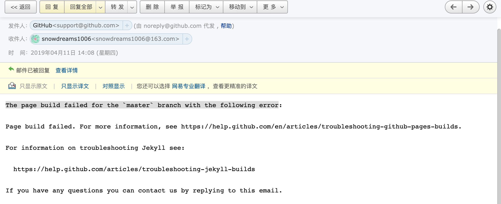

# 常见问题

## The page build failed for the `master` branch with the following error

### 问题描述



看到这封邮件,一脸懵逼,本地运行 `gitbook` 服务是正常渲染的,控制台并没有任何报错,谁知道推送到 `github` 时就报错了!

登录到 `github` 网站查看网站源码已经同步过来了,但是静态网站无法同步,本地实在找不到任何报错信息,这让我如何是好?

再看 `github` 反馈用的邮件中说道,如有问题可以回复邮件(If you have any questions you can contact us by replying to this email.).

然后死马当活马医,尝试阐释了我的问题,请求帮助定位错误日志,没想到当天下午就收到 `github` 的回复邮件,提供了解决办法!


问题是由于 `Liquid Warning: Liquid syntax error (line 334)` 错误,然而我确定这部分代码是没有任何问题的,因为这是我改造 `gitbook-plugin-tbfed-pagefooter` 插件时的一段代码,反复确认后发现并没有复制粘贴出错啊!

```
var moment = require('moment');
module.exports = {
  book: {
    assets: './assets',
    css: [
      'footer.css'
    ],
  },
  hooks: {
    'page:before': function(page) {
      var _label = '最后更新时间: ',
          _format = 'YYYY-MM-DD',
          _copy = 'powered by snowdreams1006'
      if(this.options.pluginsConfig['tbfed-pagefooter']) {
        _label = this.options.pluginsConfig['tbfed-pagefooter']['modify_label'] || _label;
        _format = this.options.pluginsConfig['tbfed-pagefooter']['modify_format'] || _format;

        var _c = this.options.pluginsConfig['tbfed-pagefooter']['copyright'];
        _copy = _c ? _c + ' all right reserved，' + _copy : _copy;
      }
      var _copy = '<span class="copyright">'+_copy+'</span>';
      var str = ' \n\n<footer class="page-footer">' + _copy +
        '<span class="footer-modification">' +
        _label +
        '\n{{file.mtime | date("' + _format +
        '")}}\n</span></footer>';

      str += '\n\n<link rel="stylesheet" href="https://unpkg.com/gitalk/dist/gitalk.css">'+
      '\n\n<script src="https://unpkg.com/gitalk@latest/dist/gitalk.min.js"></script>'+
      '\n\n<div id="gitalk-container"></div>'+
      '\n\n<script src="https://snowdreams1006.github.io/gitalk-config.js"></script>';

      page.content = page.content + str;
      return page;
    }
  },
  filters: {
    date: function(d, format) {
      return moment(d).format(format)
    }
  }
};
```

> 来源于 `gitbook-plugin-tbfed-pagefooter` 插件的 `index.js` 文件,这里为了兼容 `gitalk` 插件而集成了相关代码,详情请参考 [gitalk 评论插件](https://snowdreams1006.github.io/myGitbook/advance/plugin-practical.html#gitalk-%E8%AF%84%E8%AE%BA%E6%8F%92%E4%BB%B6)

### 解决方案

根据邮件回复,定位到出错代码片段,真的没发现有什么问题啊?


既然已经确定不是我的问题,那很可能就是 `github` 的问题了,邮件中推荐我使用 `Jekyll` 进行构建网站,不不不!

既然已经选择 `gitbook` 搭建静态网站,那就没必要再使用 `Jekyll` ,我可不想那么麻烦!

> If you are not using Jekyll you can disable it by including a .nojekyll file in the root of your repository.

所以我不妨试试新增 `.nojekyll` 文件,说不定就好使了呢!

```
$ touch .nojekyll
$ git add .nojekyll
$ git commit -m "add .nojekyll"
$ git push
```

天不负我!竟然真的好使了,再也没有收到 `github` 的报错邮件反馈了,源码和网站都正常更新了!


### 小结

据我推测,可能是 `github` 误认为我的网站是使用 `Jekyll` 工具构建的,实际上,是使用 `gitbook` 构建的!

因此,增加 `.nojekyll` 文件禁用 `Jekyll` 工具,自然不会再受相关语法限制而报错了.

所以,遇到问题时,不仅要多思考,更应该寻求官方人员的帮助,即使不回你,你也要尝试一下!

