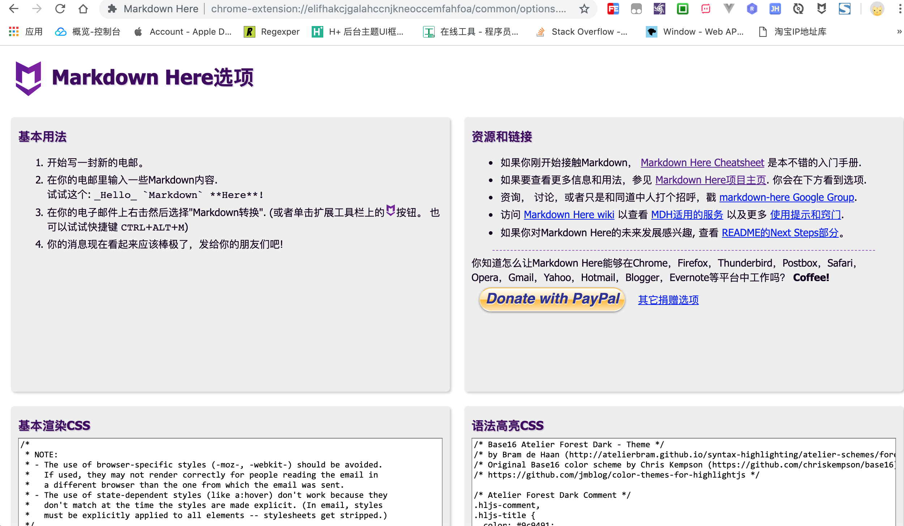
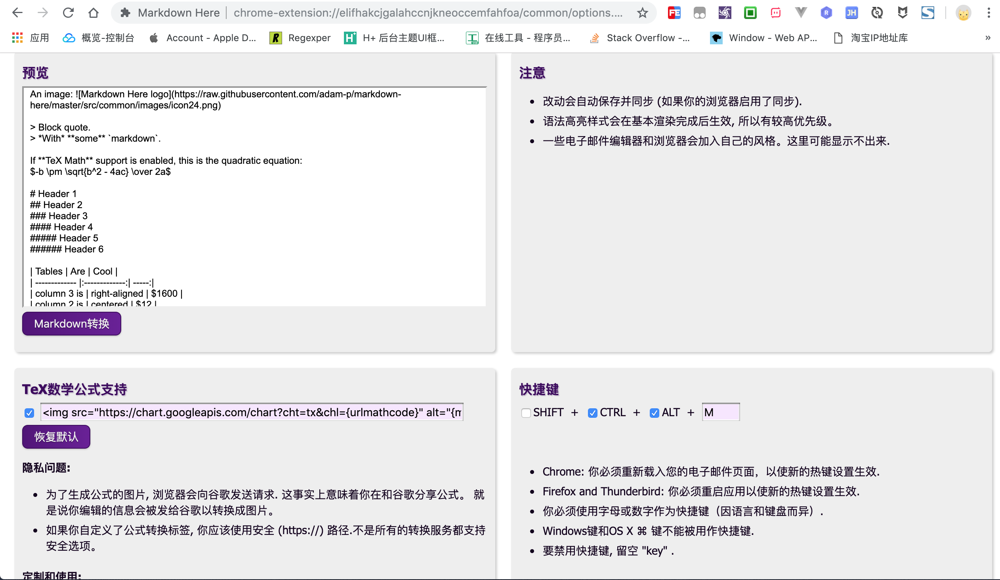
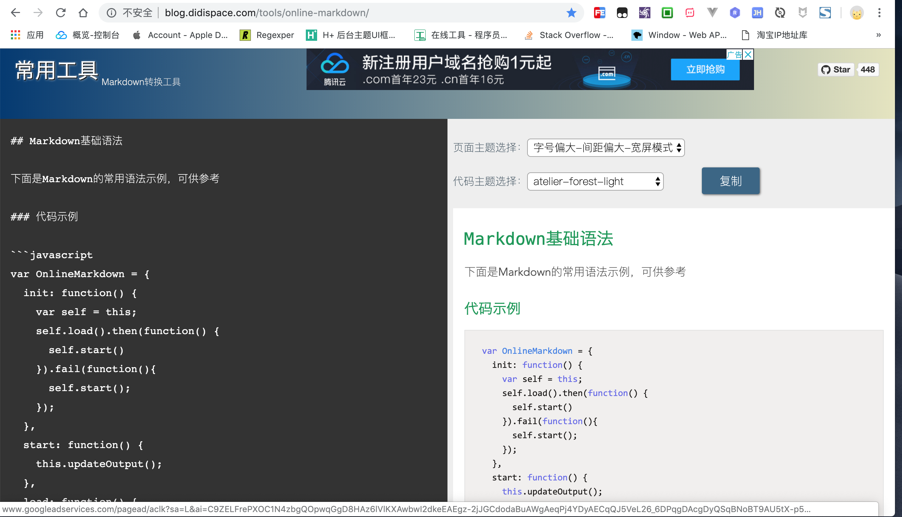

# markdown转富文本

正常情况下不太希望你能看到这篇文章,可天不遂人愿, 总有些平台至今不支持 `markdown` 语言,没办法只能迁就它!

现在遇到的问题是,部分平台仅支持富文本格式,不支持 `markdown` 格式.既然想要在这些平台上发表文章,不得不按照他们的规定做事.

下面总结下笔者在用的一些方法:

## 1. `markdown`转富文本

适合已有 `markdown` 格式的文章,想要**优雅**转换成富文本格式,这种情况下我们只要能够获取到渲染后的富文本内容,然后复制到平台的编辑器即可.

不少 `markdown` 编辑器支持实时预览,一边是 `markdown` 源码,另一边是 `富文本` 预览,选中富文本然后复制,相当简单. 

或者,将 `markdown` 源码上传到第三方平台在线转换成富文本格式,推荐 [Markdown Here](https://github.com/adam-p/markdown-here) 插件或 [在线工具](http://blog.didispace.com/tools/online-markdown/).

- `Markdown Here` chrome插件的使用方法:
  * 下载安装 `Markdown Here` 插件

    各大浏览器基本上都有相应插件,如需翻墙,请自行解决.

    

  * 配置插件并重启浏览器

    支持自定义`css`样式,内嵌多套主题可供选择.

  * 使用快捷键或命令面板转换

    默认快捷键`CTRL + ALT + M`,或者复制到插件的预览窗口,点击`Markdown 转换`

    

  * 目标富文本内容拷贝回富文本编辑器

    选中渲染后的富文本内容拷贝到目标编辑器

- `online-markdown` 在线工具的使用方法:

  * 复制源 `markdown` 内容转换成目标富文本格式

    将源 `markdown` 内容复制到左侧代码区,右侧可实时预览富文本效果

    

  * 目标富文本内容拷贝回富文本编辑器

    点击复制后到目标编辑器选择粘贴

## 2. 截图分享

适合懒癌晚期的作者,第一种方法转换后的富文本可能**无法完美移植**到某些平台时,而笔者又**懒**得重新编辑富文本,因此选择截图分享方式发布在该平台,只不过这种体验上稍差些,毕竟图片加载速度比文字相对来说还是慢很多!

**简书**和**开源中国**的 app 均支持截**长图**保存分享,网页端的话**滚动截屏**插件很多,目前在用[fireshot](https://fireshot.en.softonic.com/?ex=DSK-1262.5)还不错.

## 3. 重新编辑

适合认真负责的完美主义者,既然不支持 `markdown` 语言,那就用富文本编辑器重新编辑一份,素材和效果都有参考,再写一遍应该也不至于特别耗费时间,如果需要重写多份的话,那就另当别论了!

