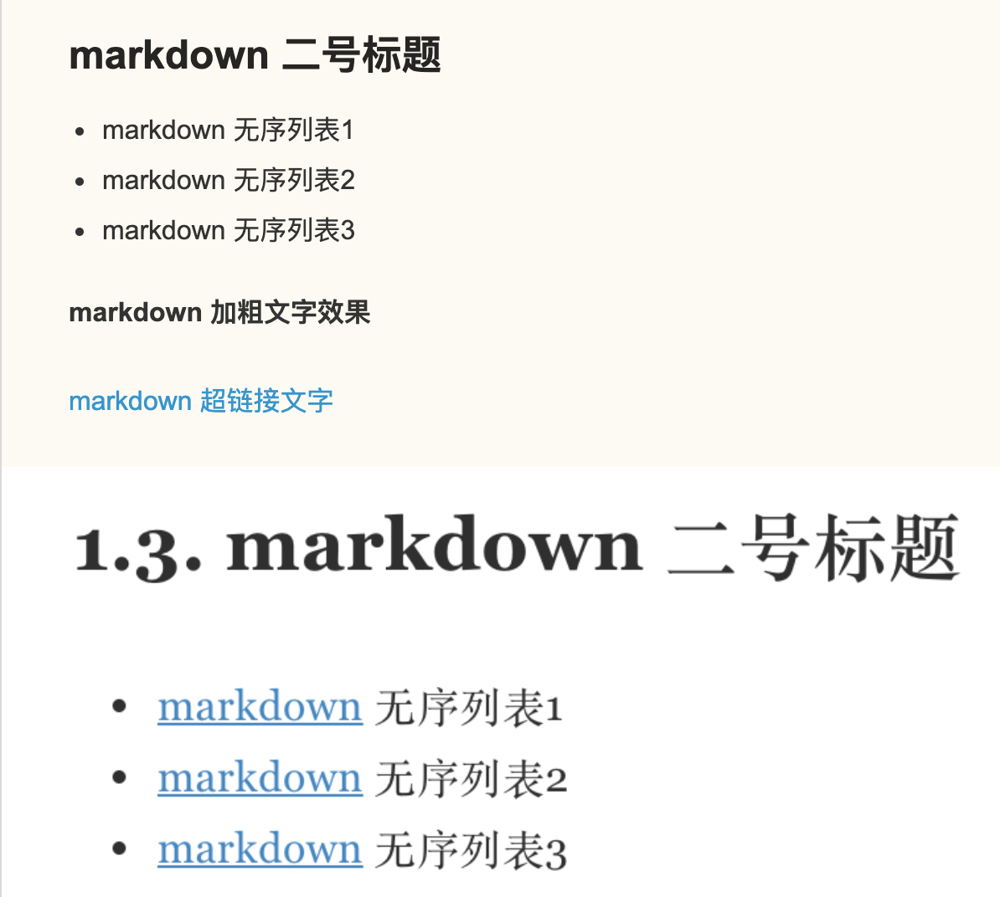
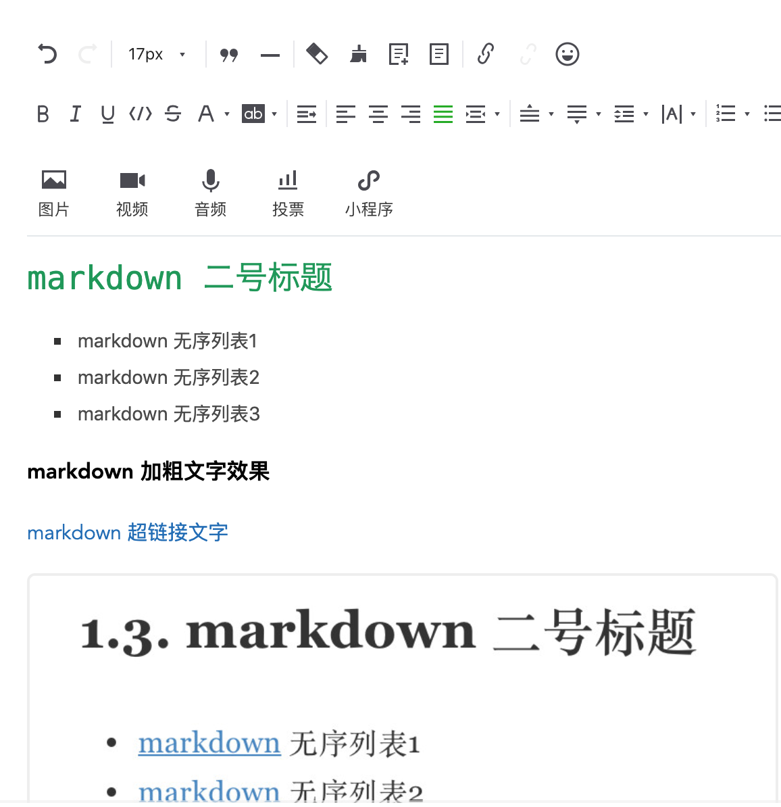

# markdown和富文本

不知道你是否留意过平时写作时的编辑器,有的是 `markdown` 编辑器,有的是各种富文本编辑器,到底选择哪一个相信你有自己的判断.

如果只是在某一家平台上写作,哪一种编辑器都无所谓,只要你喜欢就好.

可是如果你需要同时发布到各个平台呢?此时,真的需要停下来思考一下,我该使用哪一种编辑器了?

各家的编辑器的界面设计风格迥然不同,不仅按钮排序顺序不一样,而且最终输出效果也不尽相同.

这就给我们带来了一个问题,明明已经排好版的文章,复制到另外一家平台样式不一样了,或者格式被清除了?!

心中一万只羊驼呼啸而过,尽管如此,还是在心里告诉自己要冷静,要冷静!

既然我们追求的一处编写,到处复制,那么我就有必要郑重向你推荐 `markdown` 编辑器.

简单地说,`markdown` 编辑器是一种**标记语言**,写的是源码,输出的是 `html`.

所以很多情况下, `markdown`  更适合技术人员写文章,不用关心排版布局,回归写作本质,而富文本格式适合文学工作者,强调布局美观,重视审美体验.

两者看似相互独立,实际上最终展示效果几乎太大差别, `markdown` 格式和富文本格式最终都输出 `html`
格式,毕竟绝大多数阅读媒介还是各种浏览器.

> `markdown` 语法支持嵌套 `html` 语法,从而可以实现较为复杂的排版布局.

## `markdown` 格式

如果使用的是 `markdown` 格式编写文章,首先需要记忆常用的基本语法,半个小时足够入门写博客了,比`txt` 高级,比 `html` 简洁,取代 `word` 地位!

正是因为 `markdown` 语法规范,所以可以说是跨平台的写作语言,基本上各大主流的博客平台均支持 `markdown` 格式,保证了"一处编写,到处复制"的优良特性.
值得注意的是,不同平台对 `markdown` 格式的渲染结果稍有差异,甚至语法支持度不同,这要求我们尽量写通用语法或者因地制宜有针对性编写文章.

```
##  markdown 二号标题

- markdown 无序列表1
- markdown 无序列表2
- markdown 无序列表3

**markdown 加粗文字效果**

[markdown 超链接文字](https://snowdreams1006.github.io/markdown/)


```


> [markdown 快速入门](https://snowdreams1006.github.io/markdown/)

## 富文本格式

平常熟悉的 `word` 编辑器可以理解为一种富文本格式,布局,标题,超链接,图片等均以控件的形式展示,需要填写标题了点一下按钮,需要加粗效果再点一下按钮,效果直观,不需要二次渲染,但不同的平台自然是不同的布局.

一家平台的布局还不一定能够完美复制到另一家平台,虽然适合大多数人,但可移植性差!
如果需要同时发布到多家平台,简直不敢相信,复制不了样式,需要重新排版等问题绝对是一种折磨.



## 小结

- `markdown` : 拥有编程经验,不关心排版布局,专注写作多家平台发表首选 `markdown` 编辑器,"一处编写,到处复制",可移植性好,最值渲染效果也不错!

- 富文本格式: 可视化书写文章,无需编程经验的话,首选富文本编辑器,调整鼠标就能搞定页面布局还是很轻松的,同步更新到多家平台时,页面布局格式差强人意,后期维护难度大!


