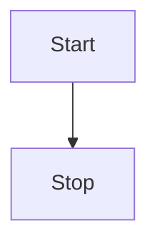
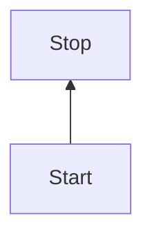
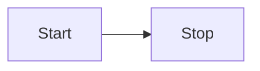

# 快速上手Mermaid流程图

本文主要介绍了如何快速上手 `Mermaid` 流程图,不用贴图上传也不用拖拉点拽绘制,基于源码实时渲染流程图,操作简单易上手,广泛被集成于主流编辑器,包括 `markdown` 写作环境.

通过本节内容你将学习到以下主要内容:

- 了解什么是流程图以及`Mermaid`流程图;
- 掌握并能记住如何绘制`Mermaid`流程图;
- 了解 `Gitbook` 写作环境的相关集成插件.


```markdown
- 快速上手Mermaid流程图
    + 什么是Mermaid流程图
        - 项目地址
        - 在线编辑
        - 在线文档
    + Mermaid流程图快速入门
        - 布局方向
            + TB
            + BT
            + LR
            + RL
        - 节点形状
            + [矩形]
                - [(圆柱)]
                - [/平行四边形/]
                - [\平行四边形\\]
                - [/梯形\\]
                - [\梯形/]
            + (圆角矩形)
                - ((圆形))
                - ([体育场])
            + {菱形}
                - {{六边形}}
            + \>不对称矩形]
        - 连接线样式
            + 实线/虚线
                - --
                - -.
            + 有箭头/无箭头
                - >
                - -
            + 有描述/无描述
                - 实线
                    + --描述文字
                    + |描述文字|
                - 虚线
                    + -.描述文字
                    + |描述文字|
            + 加粗
                - ==
            + 组合形式
                - -->
                - ---
                - -.->
                - -.-
                - 有描述实线有箭头
                    + --描述文字-->
                    + -->|描述文字|
                - 有描述实线无箭头
                    + --描述文字---
                    + ---|描述文字|
                - 有描述虚线有箭头
                    + -.描述文字-.->
                    + -.->|描述文字|
                - 有描述虚线无箭头
                    + -.描述文字-.-
                    + -.-|描述文字|
                - ==>
                - ===
                - 有描述加粗实线有箭头(2)
                    + ==描述文字==>
                    + ==>|描述文字|
                - 有描述加粗实线无箭头(2)
                    + ==描述文字===
                    + ===|描述文字|
        - 高级用法
            + -->-->
            + &
            + ""
            + %%
            + subgraph
    + 快速入门流程图回顾总结
        - 英文单词缩写
        - 几何化形状
        - 有限语法
```


## 什么是Mermaid流程图

## Mermaid流程图快速入门

## Mermaid流程图高级进阶

## 快速入门流程图回顾总结


### 方向

**关键词**

```mardown
- TB
- BT
- LR
- RL
```


```markdown
+ 方向
    - TB(从上到下)
    - BT(从下到上)
    - LR(从左往右)
    - RL(从右往左)
```


> 上下左右的英文首字母大写组合,分别是 `top`, `bottom` ,`left` 和 `right` .
> 例如: `TB` 表示 `top` 和 `bottom` 单词首字母的组合,即从上到下.



`<layout>` 布局方向,其中可选值: `TB` (从上到下),`BT` (从下到上),`LR` (从左往右)和 `RL` (从右往左)四种方向布局.

- TB

> 从上到下: from **T**op to **B**ottom

```
graph TB
    Start --> Stop
```


- BT 

> 从下到上: from **B**ottom to **T**op

```
graph BT
    Start --> Stop
```



- LR

> 从左往右: from **L**eft to **R**ight

```
graph LR
    Start --> Stop
```



- RL

> 从右往左: from **R**ight to **L**eft

```
graph BT
    Start --> Stop
```


### 形状

**关键词**

```mardown
- [矩形]
    + [[暂不支持]]
    + [(圆柱)]
    + [{暂不支持}]
    + [/平行四边形/]
    + [\平行四边形\]
    + [/梯形\]
    + [\梯形/]
- (圆角矩形)
    + ((圆形))
    + ([体育场])
    + ({暂不支持})
- {菱形}
    + {{六边形}}
    + {[暂不支持]}
    + {(暂不支持)}
- >不对称矩形]
```


```markdown
+ 形状
    - [矩形]
        + [[暂不支持]]
        + [(圆柱)]
        + [{暂不支持}]
        + [/平行四边形/]
        + [\平行四边形\\]
        + [/梯形\\]
        + [\梯形/]
    - (圆角矩形)
        + ((圆形))
        + ([体育场])
        + ({暂不支持})
    - {菱形}
        + {{六边形}}
        + {[暂不支持]}
        + {(暂不支持)}
    - \>不对称矩形]
```


> 最外层代表主形状,内层辅助修饰,其中 `[]` 表示矩形,`()` 表示圆弧,`{}` 表示尖角(窃以为 `<>` 更适合).

```
graph TD
    id
```

#### 一次性节点

默认属于矩形节点,其内容是 id,适合一次性节点,不存在重复引用的情况.

```
graph TD
    id
```

#### 可重复节点

指定节点形状,其内容是 `<node shape>`,可选值包括: `[]`(矩形) ,`()` (圆角) 和 `{}` (菱形) 等有限组合. 

- 矩形

> `[node description]`

```
graph LR
    id1[This is the text in the box]
```

- 圆角矩形

> `(node description)`

```
graph LR
    id1(This is the text in the box)
```

- 体育场

> `([node description])`

```
graph LR
    id1([This is the text in the box])
```

- 圆柱

> `[(node description)]`

```
graph LR
    id1[(Database)]
```

- 圆形

> `((node description))`

```
graph LR
    id1((This is the text in the circle))
```

- 不对称

- `>node description]`

```
graph LR
    id1>This is the text in the box]
```

- 菱形

> `{node description}`

```
graph LR
    id1{This is the text in the box}
```

- 六角形

> `{`{`node description`}`}`

```
graph LR
    id1{{This is the text in the box}}
```

- 平行四边形

> `[/node description/]`

```
graph TD
    id1[/This is the text in the box/]
```

- 另一种平行四边形

> `[\node description\]`

```
graph TD
    id1[\This is the text in the box\]
```

- 梯形

> `[/node description\]`

```
graph TD
    A[/Christmas\]
```

- 另一种梯形

> `[\node description/]`

```
graph TD
    B[\Go shopping/]
```

### 连接线

**关键词**

```mardown
- 实线/虚线(2)
    + --
        - 实线
    + -.
        - 虚线
- 有箭头/无箭头(2)
    + >
        - 有箭头
    + -
        - 无箭头
- 有描述/无描述(4)
    + 实线
        - --描述文字
        - |描述文字|
    + 虚线
        - -.描述文字
        - |描述文字|
- 加粗(1)
    + 实线
        - ==
    + 虚假
        - 不支持
- 组合形式(12+6=18)
    + 无描述实线有箭头(1)
        - -->
    + 无描述实线无箭头(1)
        - ---
    + 无描述虚线有箭头(2)
        - -.->
            + 推荐
        - .->
            + 支持
        - -.>
            + 不支持
    + 无描述虚线无箭头(1)
        - -.-
    + 有描述实线有箭头(2)
        - --描述文字-->
        - -->|描述文字|
    + 有描述实线无箭头(2)
        - --描述文字---
        - ---|描述文字|
    + 有描述虚线有箭头(2)
        - -.描述文字-.->
        - -.->|描述文字|
    + 有描述虚线无箭头(2)
        - -.描述文字-.-
        - -.-|描述文字|
    + 无描述加粗实线有箭头(1)
        - ==>
    + 无描述加粗实线无箭头(1)
        - ===
    + 有描述加粗实线有箭头(2)
        - ==描述文字==>
        - ==>|描述文字|
    + 有描述加粗实线无箭头(2)
        - ==描述文字===
        - ===|描述文字|
```


```markdown
- 连接线
    + 实线/虚线(2)
        - 实线: --
        - 虚线: -.
    + 有箭头/无箭头(2)
        - 有箭头: >
        - 无箭头: -
    + 有描述/无描述(4)
        - 实线
            + 左边位置: --描述文字
            + 右边位置: |描述文字|
        - 虚线
            + 左边位置: -.描述文字
            + 右边位置: |描述文字|
    + 加粗(1)
        - 实线: ==
        - 虚线: 不支持
    + 组合形式(12+6=18)
        - 无描述实线有箭头(1): -->
        - 无描述实线无箭头(1): ---
        - 无描述虚线有箭头(2)
            + 推荐: -.->
            + 支持: .->
            + 不支持: -.>
        - 无描述虚线无箭头(1): -.-
        - 有描述实线有箭头(2)
            + 左边位置: --描述文字-->
            + 右边位置: -->|描述文字|
        - 有描述实线无箭头(2)
            + 左边位置: --描述文字---
            + 右边位置: ---|描述文字|
        - 有描述虚线有箭头(2)
            + 左边位置: -.描述文字-.->
            + 右边位置: -.->|描述文字|
        - 有描述虚线无箭头(2)
            + 左边位置: -.描述文字-.-
            + 右边位置: -.-|描述文字|
        - 无描述加粗实线有箭头(1): ==>
        - 无描述加粗实线无箭头(1): ===
        - 有描述加粗实线有箭头(2)
            + 左边位置: ==描述文字==>
            + 右边位置: ==>|描述文字|
        - 有描述加粗实线无箭头(2)
            + 左边位置: ==描述文字===
            + 右边位置: ===|描述文字|
```


> `实线过渡到虚线,有箭头对应无箭头,先划线再加描述,位置可左可右`,其中 `--` 代表实线,实线中间多一点 `-.-` 代表虚线,添加箭头用右尖括号 `>` ,没有箭头继续用短横线 `-`.

```
graph LR
    A-->B
```

- 有箭头无描述实线

> `-->`

```
graph LR
    A-->B
```

- 无箭头实线

```
graph LR
    A --- B
```

- 带描述的有箭头实线

> `--connection line description-->`

```
graph LR
    A-- text -->B
```

> `-->|connection line description|`

```
graph LR
    A-->|text|B
```

- 带描述的无箭头实线

> `--connection line description---`

```
graph LR
    A-- This is the text ---B
```

> `---|connection line description|`

```
graph LR
    A---|This is the text|B
```

- 有箭头虚线

> `-.connection line description.->`

```
graph LR
   A-. text .-> B
```

- 有箭头加粗实线

> `==>`

```
graph LR
   A ==> B
```

- 带描述的有箭头加粗实线

> `==connection line description==>`

```
graph LR
   A == text ==> B
```

### 高级用法

- 多节点链式连接

```
graph LR
   A -- text --> B -- text2 --> C
```

- 多节点共同连接

```
graph LR
   a --> b & c--> d
```

- 多节点相互连接

```
graph TB
    A & B--> C & D
```

- 双引号包裹特殊字符

```
graph LR
    id1["This is the (text) in the box"]
```

- 双引号包裹转义字符

```
graph LR
    A["A double quote:#quot;"] -->B["A dec char:#9829;"]
```

- 嵌套子流程图

定义:

```
subgraph title
    graph definition
end
```

示例:

```
graph TB
    c1-->a2
    subgraph one
    a1-->a2
    end
    subgraph two
    b1-->b2
    end
    subgraph three
    c1-->c2
    end
```

- 注释语法

```
graph LR
%% this is a comment A -- text --> B{node}
   A -- text --> B -- text2 --> C
```

## 参考资料

- 在线体验编辑器: [Mermaid Live Editor](https://mermaid-js.github.io/mermaid-live-editor/)
- 流程图官方文档: [Flowcharts - Basic Syntax](https://mermaid-js.github.io/mermaid/#/flowchart)
- 本项目托管地址: [/mermaid-js/mermaid](https://github.com/mermaid-js/mermaid)