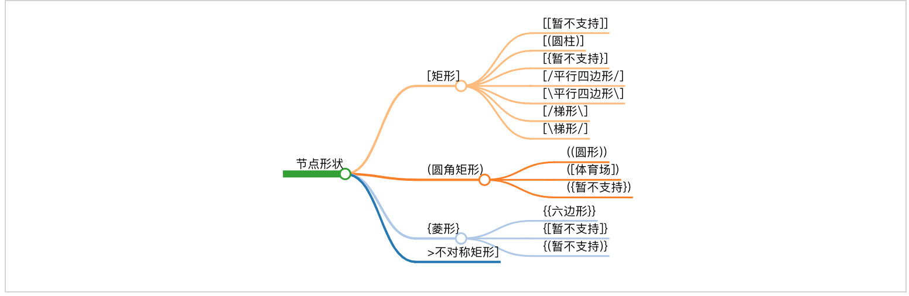

# 快速上手Mermaid流程图

本文主要介绍了如何快速上手 `Mermaid` 流程图,不用贴图上传也不用拖拉点拽绘制,基于源码实时渲染流程图,操作简单易上手,广泛被集成于主流编辑器,包括 `markdown` 写作环境.

通过本节内容你将学习到以下主要内容:

- 了解什么是流程图以及`Mermaid`流程图;
- 掌握并能记住如何绘制`Mermaid`流程图;
- 了解 `Gitbook` 写作环境的相关集成插件.

```markdown
- 快速上手Mermaid流程图
    + 什么是Mermaid流程图
        - 项目地址
        - 在线编辑
        - 官方文档
    + Mermaid流程图快速入门
        - 布局方向
            + TB
            + BT
            + LR
            + RL
        - 节点形状
            + [矩形]
                - [(圆柱)]
                - [/平行四边形/]
                - [\平行四边形\]
                - [/梯形\]
                - [\梯形/]
            + (圆角矩形)
                - ((圆形))
                - ([体育场])
            + {菱形}
                - {{六边形}}
            + >不对称矩形]
        - 连接线样式
            + 实线/虚线
                - --
                - -.
            + 有箭头/无箭头
                - >
                - -
            + 有描述/无描述
                - 实线
                    + --描述文字
                    + |描述文字|
                - 虚线
                    + -.描述文字
                    + |描述文字|
            + 加粗
                - ==
            + 组合形式
                - -->
                - ---
                - -.->
                - -.-
                - 有描述实线有箭头
                    + --描述文字-->
                    + -->|描述文字|
                - 有描述实线无箭头
                    + --描述文字---
                    + ---|描述文字|
                - 有描述虚线有箭头
                    + -.描述文字-.->
                    + -.->|描述文字|
                - 有描述虚线无箭头
                    + -.描述文字-.-
                    + -.-|描述文字|
                - ==>
                - ===
                - 有描述加粗实线有箭头(2)
                    + ==描述文字==>
                    + ==>|描述文字|
                - 有描述加粗实线无箭头(2)
                    + ==描述文字===
                    + ===|描述文字|
        - 高级用法
            + -->-->
            + &
            + ""
            + %%
            + subgraph
    + 快速入门流程图回顾总结
        - 英文单词缩写
        - 几何化形状
        - 有限语法
```

> simplemindmap style={'height':'550px','border': '1px solid lightgray;'}


## 什么是Mermaid流程图

**关键词**

```mardown
- 项目地址
- 在线编辑
- 官方文档
```

千言万语不如一张图,使用图形展示事物处理流程的图形称之为**流程图**.

`Mermaid`是一个基于 `Javascript` 的图解和制图工具.它基于 `markdown` 语法来简化和加速生成流程图的过程,也不止于生成流程图.

**源码**

```
graph TD
  A[Christmas] -->|Get money| B(Go shopping)
  B --> C{Let me think}
  C -->|One| D[Laptop]
  C -->|Two| E[iPhone]
  C -->|Three| F[fa:fa-car Car]
```

**效果**


- 项目地址: [https://github.com/mermaid-js/mermaid](https://github.com/mermaid-js/mermaid)
- 在线编辑: [https://mermaidjs.github.io/mermaid-live-editor/](https://mermaidjs.github.io/mermaid-live-editor/)
- 官方文档: [https://mermaid-js.github.io/mermaid/#/flowchart](https://mermaid-js.github.io/mermaid/#/flowchart)

## Mermaid流程图快速入门

### 布局方向

**关键词**

```mardown
+ TB
+ BT
+ LR
+ RL
```

```markdown
- 布局方向
    + TB(从上到下)
    + BT(从下到上)
    + LR(从左往右)
    + RL(从右往左)
```

> simplemindmap style={'height':'100px','border': '1px solid lightgray;'}


流程图布局方向,由四种基本方向组成,分别是英文单词: `top`(上), `bottom`(下),`left`(左)和 `right`(右).其中可选值: `TB` (从上到下),`BT` (从下到上),`LR` (从左往右)和 `RL` (从右往左)四种.

> **核心**: 仅支持上下左右四个垂直方向,是英文单词首字母大写缩写.

- TB

> 从上到下: from **T**op to **B**ottom

**源码**

```
graph TB
    Start --> Stop
```

**效果**


- BT 

> 从下到上: from **B**ottom to **T**op

**源码**

```
graph BT
    Start --> Stop
```

**效果**


- LR

> 从左往右: from **L**eft to **R**ight

**源码**

```
graph LR
    Start --> Stop
```

**效果**


- RL

> 从右往左: from **R**ight to **L**eft

**源码**

```
graph BT
    Start --> Stop
```

**效果**


### 形状

**关键词**

```mardown
- 节点形状
    + [矩形]
        - [[暂不支持]]
        - [(圆柱)]
        - [{暂不支持}]
        - [/平行四边形/]
        - [\平行四边形\]
        - [/梯形\]
        - [\梯形/]
    + (圆角矩形)
        - ((圆形))
        - ([体育场])
        - ({暂不支持})
    + {菱形}
        - {{六边形}}
        - {[暂不支持]}
        - {(暂不支持)}
    + >不对称矩形]
```

```markdown
- 节点形状
    + [矩形]
        - [[暂不支持]]
        - [(圆柱)]
        - [{暂不支持}]
        - [/平行四边形/]
        - [\平行四边形\\]
        - [/梯形\\]
        - [\梯形/]
    + (圆角矩形)
        - ((圆形))
        - ([体育场])
        - ({暂不支持})
    + {菱形}
        - {{六边形}}
        - {[暂不支持]}
        - {(暂不支持)}
    + \>不对称矩形]
```

> simplemindmap style={'height':'250px','border': '1px solid lightgray;'}



流程图节点形状,默认支持矩形和圆两种基本形状,包括基本形状的简单变体,支持嵌套组合形式,其中 `[]` 表示矩形,`()` 表示圆弧,`{}` 表示尖角(窃以为 `<>` 更适合)等等.

> **核心**: 最外层代表主形状,内层辅助修饰.

#### 一次性节点

一次性节点,默认表现为矩形节点,其文本内容直接显示 `id` 的值,适合后续不会出现多次引用的情况.

> `id` 建议直接写成有意义的文本描述而不是当成唯一标识.

**源码**

```
graph TD
    id
```

**效果**


#### 可重复节点

可重复节点,指定节点形状,其文本内容不再是 `id` 的值而是 `<node shape>` 的值,适合后续出现多次引用相同节点的情况.

> `id` 代表节点的唯一标识,当前节点的文本描述由 `<node shape>` 的值指定,建议 `id` 写成有意义的唯一标识.

- 矩形

> 一般格式: `[node description]` ,`[]` 中括号表示节点是**矩形**形状,`node description` 是节点的描述文本.

**源码**

```
graph LR
    id1[This is the text in the box]
```

**效果**


- 圆角矩形

> 一般格式: `(node description)` ,`()` 小括号表示节点是**圆角矩形**形状,`node description` 是节点的描述文本.

**源码**

```
graph LR
    id1(This is the text in the box)
```

**效果**


- 体育场

> 一般格式: `([node description])` ,`()` 小括号嵌套 `[]` 中括号表示节点是大弧度的圆角矩形形状,也就是**体育场**形状,`node description` 是节点的描述文本.

**源码**

```
graph LR
    id1([This is the text in the box])
```

**效果**


- 圆柱

> 一般格式: `[(node description)]` ,`[]` 中括号嵌套 `()` 小括号表示节点是**圆柱**形状,`node description` 是节点的描述文本.

**源码**

```
graph LR
    id1[(Database)]
```

**效果**


- 圆形

> 一般格式: `((node description))` ,`()` 小括号嵌套 `()` 小括号表示节点是**圆形**形状,`node description` 是节点的描述文本.

**源码**

```
graph LR
    id1((This is the text in the circle))
```

**效果**


- 不对称矩形

> 一般格式: `>node description]` ,左边是右尖括号 `>` ,右边是右中括号 `]` 表示**不对称矩形**形状,`node description` 是节点的描述文本.

**源码**

```
graph LR
    id1>This is the text in the box]
```

**效果**


- 菱形

> 一般格式: `{node description}` ,`{}` 大括号表示**菱形**形状,`node description` 是节点的描述文本.

**源码**

```
graph LR
    id1{This is the text in the box}
```

**效果**


- 六角形

> 一般格式: `{`{`node description`}`}` ,`{}` 大括号嵌套 `{}` 大括号表示**六角形**形状,`node description` 是节点的描述文本.

**源码**

```
graph LR
    id1{{This is the text in the box}}
```

**效果**


- 平行四边形

> 一般格式: `[/node description/]` ,`[]` 中括号嵌套 `//` 左斜杠表示**左斜平行四边形**形状,`node description` 是节点的描述文本.

**源码**

```
graph TD
    id1[/This is the text in the box/]
```

**效果**


- 平行四边形

> 一般格式: `[\node description\]` ,`[]` 中括号嵌套 `\\` 右斜杠表示**右斜平行四边形**形状,`node description` 是节点的描述文本.

**源码**

```
graph TD
    id1[\This is the text in the box\]
```

**效果**


- 梯形

> 一般格式: `[/node description\]` ,`[]` 中括号嵌套 `/\` 左右斜杠表示**上短下长梯形**形状,`node description` 是节点的描述文本.

**源码**

```
graph TD
    A[/Christmas\]
```

**效果**


- 另一种梯形

> 一般格式: `[\node description/]` ,`[]` 中括号嵌套 `\/` 右左斜杠表示**上长下短梯形**形状,`node description` 是节点的描述文本.

**源码**

```
graph TD
    B[\Go shopping/]
```

**效果**


### 连接线

**关键词**

```mardown
+ 实线/虚线
    - --
    - -.
+ 有箭头/无箭头
    - >
    - -
+ 有描述/无描述
    - 实线
        + --描述文字
        + |描述文字|
    - 虚线
        + -.描述文字
        + |描述文字|
+ 加粗
    - ==
+ 组合形式
    - -->
    - ---
    - -.->
    - -.-
    - 有描述实线有箭头
        + --描述文字-->
        + -->|描述文字|
    - 有描述实线无箭头
        + --描述文字---
        + ---|描述文字|
    - 有描述虚线有箭头
        + -.描述文字-.->
        + -.->|描述文字|
    - 有描述虚线无箭头
        + -.描述文字-.-
        + -.-|描述文字|
    - ==>
    - ===
    - 有描述加粗实线有箭头(2)
        + ==描述文字==>
        + ==>|描述文字|
    - 有描述加粗实线无箭头(2)
        + ==描述文字===
        + ===|描述文字|
```

```markdown
- 连接线样式
    + 实线/虚线
        - 实线: --
        - 虚线: -.
    + 有箭头/无箭头
        - 有箭头: >
        - 无箭头: -
    + 有描述/无描述
        - 实线
            + 左边位置: --描述文字
            + 右边位置: |描述文字|
        - 虚线
            + 左边位置: -.描述文字
            + 右边位置: |描述文字|
    + 加粗
        - 实线: ==
        - 虚线: 不支持
    + 组合形式
        - 无描述实线有箭头: -->
        - 无描述实线无箭头: ---
        - 无描述虚线有箭头
            + 推荐: -.->
            + 支持: .->
            + 不支持: -.>
        - 无描述虚线无箭头: -.-
        - 有描述实线有箭头
            + 左边位置: --描述文字-->
            + 右边位置: -->|描述文字|
        - 有描述实线无箭头
            + 左边位置: --描述文字---
            + 右边位置: ---|描述文字|
        - 有描述虚线有箭头
            + 左边位置: -.描述文字-.->
            + 右边位置: -.->|描述文字|
        - 有描述虚线无箭头
            + 左边位置: -.描述文字-.-
            + 右边位置: -.-|描述文字|
        - 无描述加粗实线有箭头: ==>
        - 无描述加粗实线无箭头: ===
        - 有描述加粗实线有箭头
            + 左边位置: ==描述文字==>
            + 右边位置: ==>|描述文字|
        - 有描述加粗实线无箭头
            + 左边位置: ==描述文字===
            + 右边位置: ===|描述文字|
```

> simplemindmap style={'height':'550px','border': '1px solid lightgray;'}


流程图连接线样式,支持实线和虚线以及有箭头样式和无箭头样式,除此之外还支持添加连接线描述文字,其中 `--` 代表实线,实线中间多一点 `-.-` 代表虚线,添加箭头用右尖括号 `>` ,没有箭头继续用短横线 `-`.

> **核心**: 先实线再虚线,先有箭头再去箭头,左边位置添加描述文字需要区分实现还是虚线,右边位置添加描述文字格式一致.

- 有箭头无描述实线

> 一般格式: `-->` ,其中 `--` 表示实线,`>` 表示有箭头.

**源码**

```
graph LR
    A-->B
```

**效果**


- 无箭头实线

> 一般格式: `---` ,其中 `--` 表示实线,`-` 表示无箭头.

**源码**

```
graph LR
    A --- B
```

**效果**


- 带描述的有箭头实线

> 一般格式: `--connection line description-->` ,其中左边的 `--` 添加到**实线左边位置**,右边的 `-->` 表示**带箭头的实线**.

**源码**

```
graph LR
    A-- text -->B
```

**效果**

```mermaid
graph LR
    A-- text -->B
```

> 一般格式: `|connection line description|` ,其中 `||` 添加到**连接线右边位置**.

**源码**

```
graph LR
    A-->|text|B
```

**效果**

```mermaid
graph LR
    A-->|text|B
```

- 带描述的无箭头实线

> 一般格式: `--connection line description` ,其中左边的 `--` 添加到**实线左边位置**,右边的 `---` 表示**不带箭头的实线**.

**源码**

```
graph LR
    A-- This is the text ---B
```

**效果**

```mermaid
graph LR
    A-- This is the text ---B
```

> 一般格式: `|connection line description|` ,其中 `||` 添加到**连接线右边位置**.

**源码**

```
graph LR
    A---|This is the text|B
```

**效果**

```mermaid
graph LR
    A---|This is the text|B
```

- 有箭头虚线

> 一般格式: `-.connection line description.->` ,其中左边的 `-.` 添加到**虚线左边位置**,右边的 `.->` 表示**带箭头的虚线**.

**源码**

```
graph LR
   A-. text .-> B
```

**效果**

```mermaid
graph LR
   A-. text .-> B
```

- 有箭头加粗实线

> 一般格式: `==>` ,表示加粗实线.

**源码**

```
graph LR
   A ==> B
```

**效果**

```mermaid
graph LR
   A ==> B
```

- 带描述的有箭头加粗实线

> 一般格式: `==connection line description` ,左边的 `==` 添加到加粗实现左边,右边的 `==>` 代表加粗实线.

**源码**

```
graph LR
   A == text ==> B
```

**效果**

```mermaid
graph LR
   A == text ==> B
```

- 带描述的有箭头加粗实线

> 一般格式: `|connection line description|` ,其中 `||` 添加到**连接线右边位置**.

**源码**

```
graph LR
   A ==>|text| B
```

**效果**

```mermaid
graph LR
   A ==>|text| B
```

### 高级用法

- 多节点链式连接

```
graph LR
   A -- text --> B -- text2 --> C
```

- 多节点共同连接

```
graph LR
   a --> b & c--> d
```

- 多节点相互连接

```
graph TB
    A & B--> C & D
```

- 双引号包裹特殊字符

```
graph LR
    id1["This is the (text) in the box"]
```

- 双引号包裹转义字符

```
graph LR
    A["A double quote:#quot;"] -->B["A dec char:#9829;"]
```

- 嵌套子流程图

定义:

```
subgraph title
    graph definition
end
```

示例:

```
graph TB
    c1-->a2
    subgraph one
    a1-->a2
    end
    subgraph two
    b1-->b2
    end
    subgraph three
    c1-->c2
    end
```

- 注释语法

```
graph LR
%% this is a comment A -- text --> B{node}
   A -- text --> B -- text2 --> C
```

## Mermaid流程图高级进阶

## 快速入门流程图回顾总结
