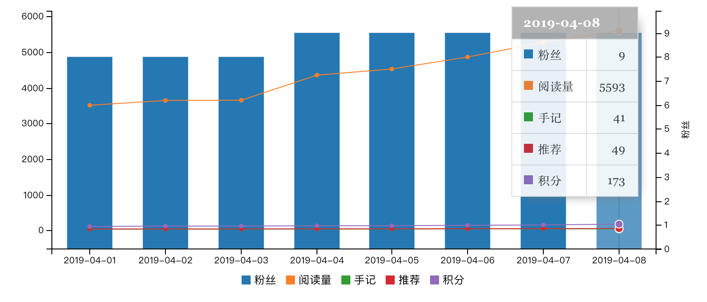
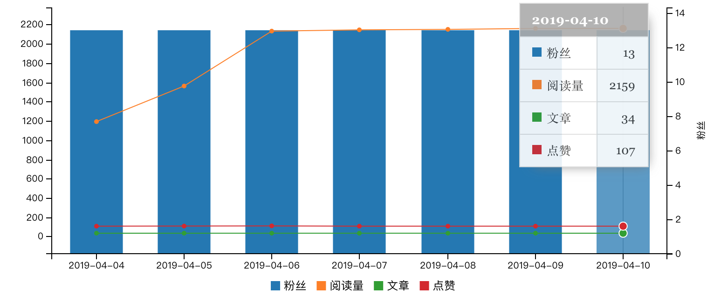
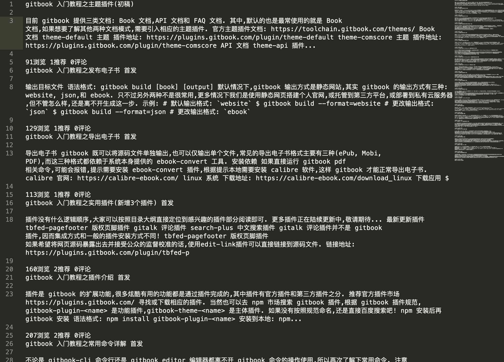

# 半手动版数据统计

## 需求背景

作为正在探索如何写作并发表到各大博客平台的新人,目前虽然已基本弄清写作和发表的基本流程,但是离打造个人知名度还差很大很大一段距离.

尤其处于新手阶段,需要的更是自信与外界的积极反馈,看着各平台日益增长的阅读量和粉丝量,心中自然不甚欣喜.

但是,持续的技术输出能否坚持下去很大程度上靠的是外界的积极反馈,如果写的文章基本没人看,或者反映并不理想,估计也很难再坚持创作了.

所以笔者**每天晚上**都会统计一下各个平台的数据,看一下有哪些收获,只有看得见的数据才能给我**安全感和自信心**.

下面简单展示一下每日数据统计效果:

## 每日数据统计

这里列出的平台默认是没有提供数据分析功能,而有些平台已经提供数据分析,说不定还要丰富图表分析功能,自然不用像下面这般复杂操作.

所以,针对没有提供数据分析的平台,只好采用**人工方式**进行每日数据统计,一开始文章比较少,用肉眼加计算器就能很轻松得到阅读量和粉丝数等数据.

但是,随着文章的每日更新,不断累加的文章越来越多,**人工方式**简直让我崩溃,比如昨晚在统计慕课网手记相关数据时就意外被一旁的小侄子**打断三次**!

简直不可忍受,穷则思变,懒则想法偷懒,所以是时候探索新的方式解决**纯手动的弊端**了!

### 全网汇总数据


### 慕课手记



### 简书


### 博客园


### 腾讯云社区



> 图表渲染效果来自 `gitbook` 的 `chart` 插件,详情请参考 [官网文档](https://plugins.gitbook.com/plugin/chart)

## 懒则想法偷懒

### 回顾操作流程

要想解放重复劳动量,必须先知道问题瓶颈,现在先回顾一下手动操作流程.

1. 登录各大博客平台后台,找到文章列表.
2. 打开计算器按照阅读量等指标累加每篇文章的相关数据.
3. 更新统计页面数据,利用 `chart` 插件渲染图标.
4. 修改 `chart` 渲染数据语法,截图渲染效果.
5. 确认渲染效果并推送到 `github` 网站

> 本来不必利用截图表示图表的,只是无奈 `github` 不支持 `chart` 插件语法,只好用截图代替了.

### 思考问题瓶颈

分析上述流程后不难发现,最复杂也是最费时费力的便是第二步的数据统计,由于要**肉眼统计**文章并用计算器累加,简直是手脑并用,只有高度专注才能保证统计数据的准确性和可靠性.

这也就解释了被打断三次后的崩溃了,找到问题的根源了,想办法如何解决吧!

最容易想到的解决办法是手动复制文章列表数据,然后程序分析提取关键数据,最后再统计数据.

又是三步操作,再分解一下步骤,看看目前能够解决哪部分.

1. 手动复制文章列表数据
2. 程序分析提取关键数据
3. 统计指标数据

在这三步中,只有第二步最为关键,也是目前我能做到的事情,因为第一步可能需要爬虫技术或模拟接口调用,总体来说,总体来说还是比较麻烦的,以后再继续优化吧.

### 梳理操作流程

因此,现在先着手如何将复制后的文章列表转化成程序能够处理的文件格式,进而调用程序统计.

下面以慕课网手记文章为例,简单介绍下处理流程.

#### 手动复制文章


现在文章已复制到文件,应该保存成什么格式呢?这又是一个思考点.



由于文件内容最终需要被程序处理,而程序处理要求数据需要具备一定的格式,因此自然不能是 `txt` 或 `word` 这类文档,平常接触比较多的文档数据处理一般就是 `excel` 或者 `json` 类型的文档.

这里需要 `excel` 这种格式文档,但是 `excel` 比较笨重,还需要相关软件才能打开 `excel` 文件,好像并不是很适合,怎么办呢?

但是我真的需要这种一行一行的数据格式啊,有没有折中的处理方案?

当然有!轻量级的 `csv` 格式不是巧合适合简单文档处理吗?

`csv` 和 `excel` 具有类似的特征,大体上都是一行一行一列一列地存储数据,最适合统计数据了.

看着乱七八糟的文章列表,`csv` 也无法处理这种复杂数据啊,接下来还是要手动格式化数据,整理一下数据.


#### 程序分析提取

至此,我们已经完成数据分析的第一步了,接下来是如何读取 `csv` 文件,由于本人是 `java` 程序员,所以我要看一下 `java` 如何处理 `csv` 文件.

需求很简单,编写一个 `csv` 工具类并实现基本的写入和读取操作即可.

说到工具类当然首选现成的开源工具了,毕竟小小的需求不值得造轮子.

##### 寻求解决方案

说到开源工具,脑海中第一个闪现的是 `Apache Commons` 工具类,所以先去 `maven` 上搜一下有没有 `csv` 相关的工具类.

[在线搜索 commons-csv](https://mvnrepository.com/search?q=commons-csv)


天不负我!果然有 `csv` 相关工具类,下面就开始研究如何调用吧!

- 集成 `commons-csv` 工具类

```
<!-- https://mvnrepository.com/artifact/org.apache.commons/commons-csv -->
<dependency>
    <groupId>org.apache.commons</groupId>
    <artifactId>commons-csv</artifactId>
    <version>1.6</version>
</dependency>
```

- 编写工具类

```
/**
 * 写入csv文件
 *
 * @param data     数据内容
 * @param filePath 文件路径
 * @throws IOException
 **/
public static void writeCsv(List<String[]> data, String filePath) throws IOException {
    FileWriter fw = new FileWriter(new File(filePath));
    final CSVPrinter printer = CSVFormat.EXCEL.print(fw);
    printer.printRecords(data);
    printer.flush();
    printer.close();
}

/**
 * 读取csv文件
 *
 * @param filePath 文件路径
 * @return CSVRecord 迭代对象
 * @throws IOException
 **/
public static Iterable<CSVRecord> readCSV(String filePath) throws IOException {
    InputStream inputStream = new FileInputStream(filePath);
    InputStreamReader isr = new InputStreamReader(inputStream);
    Iterable<CSVRecord> records = CSVFormat.EXCEL.parse(isr);
    return records;
}

/**
 * 测试写入并读取csv 文件
 */
private static void testWriteAndRead() throws IOException {
    //写入数据
    List<String[]> data = new ArrayList<String[]>();
    data.add(new String[]{"张三", "18", "3000"});
    data.add(new String[]{"李四", "20", "4000"});
    data.add(new String[]{"王二", "25", "5000"});

    //写入文件路径
    String path = "/Users/sunpo/Downloads/testWriteAndRead.csv";

    //写入 csv 文件
    writeCsv(data, path);

    //读取文件
    Iterable<CSVRecord> records = readCSV(path);
    for (CSVRecord record : records) {
        for (String string : record) {
            System.out.print(string);
            System.out.print(" ");
        }
        System.out.println();
    }
}
```

- 测试写入并读取功能


测试结果真实可用,工具类基本功能编写完成.


##### 制定解决方案

已经有了 `csv` 工具类,那么现在就要想办法解决实际问题,再看一下当前慕课网手记的内容格式吧!

```
148浏览 2推荐 0评论
204浏览 2推荐 0评论
181浏览 2推荐 0评论
```

分析上述内容格式有以下特点:

- 内容数据一行一条数据,可能需要换行符问题
- 每一行数据以空格分割,可分割成数组或列表再处理
- 已分割后的列表项包括了有效数据和文字说明,可能需要过滤出有效数据

按照上述分析结果,开始 `coding` 逐个解决,下面展示下关键代码.

- 按照空格将每一行数据分割成列表

```
List<String> row = StringTools.splitToListString(string, " ");
```

> `StringTools.splitToListString` 方式是笔者封装的分割字符串方法,目的将字符串按照指定分隔符分割成字符串列表

- 处理分割后字符串列表并过来出有效数据

```
String readCountWithDescString = row.get(0);
String readCountString = StringUtils.substringBefore(readCountWithDescString, "浏览");

String recommendCountWithDescString = row.get(1);
String recommendCountString = StringUtils.substringBefore(recommendCountWithDescString, "推荐");

String commentCountWithDescString = row.get(2);
String commentCountString = StringUtils.substringBefore(commentCountWithDescString, "评论");
```

> `StringUtils.substringBefore` 方法也是`Apache Commons` 工具类,具体来源于 `org.apache.commons.lang3` ,下述涉及到的 `StringUtils` 静态方法 也是,不再单独说明.

- 最后一步即统计分析

```
//浏览数
int readCount = 0;
//推荐数
int recommendCount = 0;
//评论数
int commentCount = 0;

readCount += Integer.parseInt(readCountString);
recommendCount += Integer.parseInt(recommendCountString);
commentCount += Integer.parseInt(commentCountString);
```

##### 实施解决方案

如此一来,三步均已解决,现在运行以下统计方法,看一下真实效果如何.

```
/**
 * 统计慕课手记
 *
 * @throws IOException
 */
private static void countImooc() throws IOException {
    //昨日统计数据
    String yesterday = DateFormatUtils.format(DateUtils.addDays(new Date(), -1), "yyyyMMdd");
    String path = String.format("/Users/sunpo/Documents/workspace/count/imooc-%s.csv", yesterday);

    //总行数
    int allRows = 0;
    //有效行数
    int allValidRows = 0;
    //当前行是否有效
    boolean isValidRow = true;
    //浏览数
    int readCount = 0;
    //推荐数
    int recommendCount = 0;
    //评论数
    int commentCount = 0;

    Iterable<CSVRecord> records = readCSV(path);
    for (CSVRecord record : records) {
        allRows++;

        for (String string : record) {
            System.out.println(string);

            if (StringUtils.isBlank(string)) {
                isValidRow = false;
                break;
            }

            List<String> row = StringTools.splitToListString(string, " ");

            String readCountWithDescString = row.get(0);
            String readCountString = StringUtils.substringBefore(readCountWithDescString, "浏览");

            String recommendCountWithDescString = row.get(1);
            String recommendCountString = StringUtils.substringBefore(recommendCountWithDescString, "推荐");

            String commentCountWithDescString = row.get(2);
            String commentCountString = StringUtils.substringBefore(commentCountWithDescString, "评论");

            readCount += Integer.parseInt(readCountString);
            recommendCount += Integer.parseInt(recommendCountString);
            commentCount += Integer.parseInt(commentCountString);
        }

        if (isValidRow) {
            allValidRows++;
        }
        isValidRow = true;
    }
    System.out.println();
    System.out.println(String.format("[慕课手记] 一共读取%d行,有效行: allValidRows = %d ,其中浏览数: readCount = %d ,推荐数: recommendCount = %d ,评论数: commentCount = %d", allRows, allValidRows, readCount, recommendCount, commentCount));
    System.out.println();
}
```


很完美,终于不必再肉眼统计数据了,虽然很长程度上仍然依赖人工整理好 `csv` 文件,但是目前已经解决了纯手动的弊端.

因此,上述解决方案是半手动的方式,仍然还有很多可以优化的地方,等下次忍受不了这种方案时再解决!

## 小结


