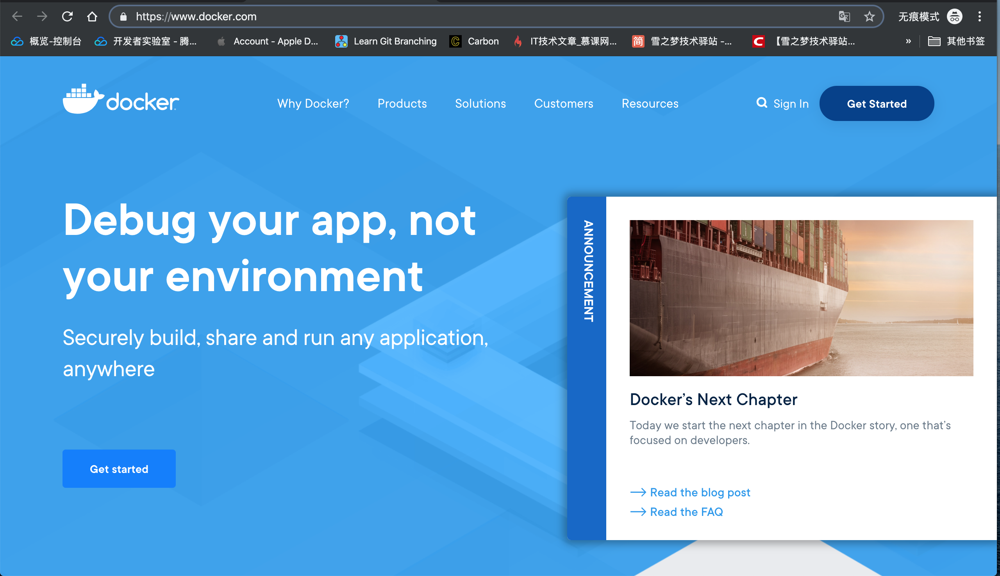

# 跟着官方体验 Docker

传统部署开发项目时往往需要上传项目,安装依赖环境,配置环境变量等等操作才能启动项目,而更加优雅的部署项目应该可以简化上述步骤,这种需求的刺激下 `Docker` 也就应运而生.

`Docker` 不仅可以打包你的项目还可以打包运行环境,只要本地开发正常,打包后上传到服务器也会正常,再也不会喊出 "在我的电脑运行好好的啊!" 这种话了呢!

话不多说,先让我们跟着官方一起学习体验一下 `Docker` 的神奇魅力之处吧!

## 搜一下 docker 找官网

打开任意一款浏览器,在搜索框中输入关键字 `docker` 后***百度一下***,搜索结果右侧带有 `官方` 标识或者下方网址包含 `docker` 的那条记录就是目标网站,比如以下示例的第二条,此方法也适用于探索其他陌生网站.

只要耐心往下翻翻找到搜索结果右侧的 `官方` 标志,那么这条搜索结果就是官方网站,除了用电脑进行搜索,平时使用最多的就是手机浏览器了.

好奇心的驱使下,分别用 `今日头条,百度,QQ浏览器` 搜索 `docker` 关键字,发现搜索结果很有意思.

- `今日头条` 搜索结果中第一条结果就是官网,最令人满意,看样子今日头条布局搜索后确实不错!
- `百度` 搜索结果中第一条是广告,接下来是百度翻译,百度百科,第二页结果才出现了官方,还是那个我们熟悉的百度.
- `QQ浏览器` 最牛逼了,不管是第一页还是第二页,根本就没有官网,无招胜有招,这让我无话可说了.

> 现在打开你的浏览器,搜索 `docker` 关键字看看官方出现在什么位置,欢迎评论区留言告诉我!

## 宾至如归地部署项目

> 官方网站: [https://www.docker.com/](https://www.docker.com/)

根据上文找到官网后,首先映入眼帘的便是简明扼要的自我介绍,`Debug your app, not your environment` 翻译成中文是说**不在你的环境调试你的应用**,这句话可能有些歧义,调试自己的应用时难道不是自己的开发环境?

所以下方还有略小的说明文字辅助解释,`Securely build, share and run any application, anywhere` 即 **安全地构建,分享,运行任何应用到任何地方**. 

由此可见,`Debug your app, not your environment` 其实表达的意思是问题场景,而 `Securely build, share and run any application, anywhere` 说的才是功能介绍.

- 问题: 如果遇到非本地开发环境情况下,需要调试你的应用怎么办?
- 回答: `docker` 可以安全构建,分享并运行任何程序到任意地方.(弦外之音是说无论身在何处,真实运行环境都和你本地开发环境保持一致,还会怕因为环境不同步而导致的意外 bug 吗)

如果让我一句话概况 `docker` 到底是什么,那么我会说: `是一种宾至如部署项目的工具!`

