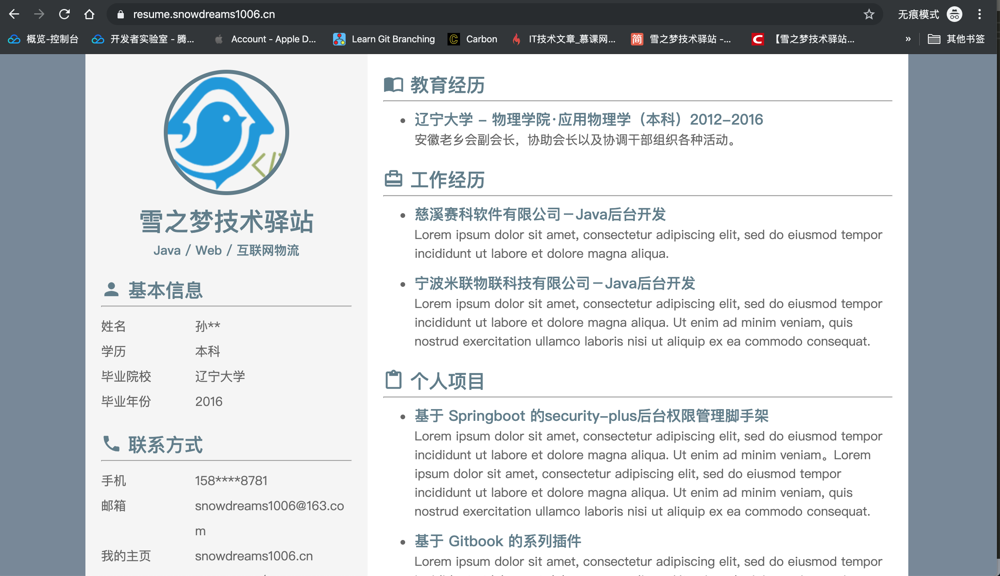
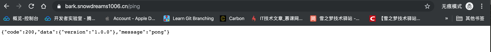
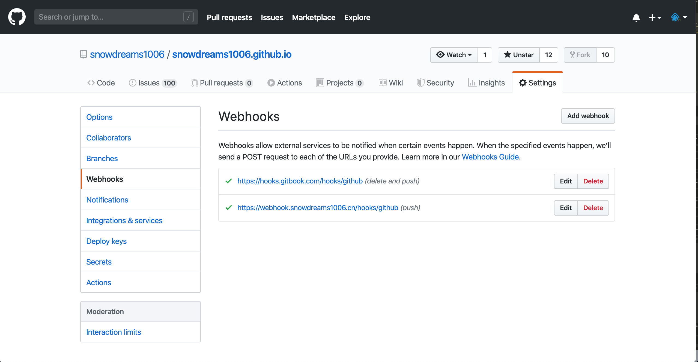

# 更好的部署方式

如果你需要经常性不止一处地部署同样的项目,如果你曾经也遇到过"明明在我电脑运行得好好的"问题,如果听说过 `Docker` 但还没用过,如果你不确定你到底需不需要 `Docker` ,那么,希望你花时间阅读一下这篇文章!

因为 `Docker` 将帮助你轻松运行自己不熟悉语言编写的开源项目,帮助你更加优雅简单部署自己的项目,帮助你省去重复的下载环境配置环境的繁琐过程...

让我们先睹为快,预览一下基于 `Docker` 部署项目的实际效果,对 `Docker` 实现的大致效果有个直观印象.

- `Docker` 部署的 `nginx` 作为反向代理服务器,支持 `https` 访问以及泛域名解析.

> 体验地址: [https://snowdreams1006.cn/](https://snowdreams1006.cn/)


- `Docker` 部署的 `letsencrypt` 免费制作泛域名证书并整合反向代理服务 `nginx` 实现 `https` 访问.

> 体验地址: [https://www.snowdreams1006.cn/](https://www.snowdreams1006.cn/)


- `Docker` 部署的 `nginx` 作为静态服务器,部署静态网站用于演示静态博客功能.

> 体验地址: [https://resume.snowdreams1006.cn/](https://resume.snowdreams1006.cn/)



- `Docker` 部署的 `bark` 作为后端服务器,部署开源项目用于充当消息推送服务器.

> 体验地址: [https://bark.snowdreams1006.cn/ping](https://bark.snowdreams1006.cn/ping)



- `Docker` 部署的 `webhook` 作为后端服务器,部署开源项目用于接收 `Webhook` 事件回调.

> 体验地址: [https://webhook.snowdreams1006.cn/hooks/github](https://webhook.snowdreams1006.cn/hooks/github)



- `Docker` 部署的 `blog` 作为静态服务器,基于 `Github Action` 或 `Webhook` 实现博客内容自动更新并推送消息通知.

> `Github` 仓库内容更新后触发 `Github Action` 自动构建并部署远程服务器静态博客,同时发送的 `Webhook` 事件给 `webhook` 钩子容器,紧接着调用 `bark` 消息推送容器,实现消息推送到微信消息以及 app 通知.


> `Github` 仓库更新后自动运行 `Github Action` 源码构建静态博客并上传到远程服务器,`blog` 容器会立即重启完成内容更新.


> `Github` 仓库更新后发送 `Webhooks` 到远程服务器,`webhook` 容器接收到请求后转发给 `bark` 容器,进而推送给手机.

无论是熟悉的开源项目还是陌生的开源项目,`Docker` 让这些不一样变得一样,统一的管理方式使得使用成本大大降低,更加优雅地部署项目不止是说说而已!

## 前提条件

目前在 `Linux` 系统上安装 `Docker`,对系统版本有以下要求:

- CentOS : 7
- Debian : 7.7(Wheezy LTS)、8.0(Jessie LTS)、9(Stretch)
- Fedora : 24、25
- Ubuntu : 16.04(Xenial LTS)、14.04(Trusty LTS)、17.04(Zesty)

上述前提条件基本上新服务器都满足要求,并未深入实验,可以自行验证,下面主要以 `Centos7.6` 为例讲解如何安装 `Docker` .

## 验证环境

对于新手来说,尽管安装 `Docker` 非常简单,但是总是不可避免地会遇到一些意外情况,或许是安装出错需要重新安装或者是不确定远程服务器是否已经安装,所以开始安装前还是先看一下到底有没有安装过 `Docker` 吧!

- 调用 `docker` 命令

连接到远程服务器后运行 `docker` 命令,如果像下面那样输出一大堆用法介绍,那么证明 `Docker` 已经成功安装过,并且可能已经配置好相关环境了.

你现在唯一要做的就是学习一下 `Docker` 的基本用法,不能自己重头安装环境,基本上可以不必往下看了.

```bash
[root@snowdreams1006 ~]# docker

Usage:	docker [OPTIONS] COMMAND

A self-sufficient runtime for containers

Options:
      --config string      Location of client config files (default "/root/.docker")
  -c, --context string     Name of the context to use to connect to the daemon (overrides DOCKER_HOST env var and default context set with "docker context use")
  -D, --debug              Enable debug mode
  -H, --host list          Daemon socket(s) to connect to
  -l, --log-level string   Set the logging level ("debug"|"info"|"warn"|"error"|"fatal") (default "info")
      --tls                Use TLS; implied by --tlsverify
      --tlscacert string   Trust certs signed only by this CA (default "/root/.docker/ca.pem")
      --tlscert string     Path to TLS certificate file (default "/root/.docker/cert.pem")
      --tlskey string      Path to TLS key file (default "/root/.docker/key.pem")
      --tlsverify          Use TLS and verify the remote
  -v, --version            Print version information and quit

Management Commands:
  builder     Manage builds
  config      Manage Docker configs
  container   Manage containers
  context     Manage contexts
  engine      Manage the docker engine
  image       Manage images
  network     Manage networks
  node        Manage Swarm nodes
  plugin      Manage plugins
  secret      Manage Docker secrets
  service     Manage services
  stack       Manage Docker stacks
  swarm       Manage Swarm
  system      Manage Docker
  trust       Manage trust on Docker images
  volume      Manage volumes

Commands:
  attach      Attach local standard input, output, and error streams to a running container
  build       Build an image from a Dockerfile
  commit      Create a new image from a container's changes
  cp          Copy files/folders between a container and the local filesystem
  create      Create a new container
  diff        Inspect changes to files or directories on a container's filesystem
  events      Get real time events from the server
  exec        Run a command in a running container
  export      Export a container's filesystem as a tar archive
  history     Show the history of an image
  images      List images
  import      Import the contents from a tarball to create a filesystem image
  info        Display system-wide information
  inspect     Return low-level information on Docker objects
  kill        Kill one or more running containers
  load        Load an image from a tar archive or STDIN
  login       Log in to a Docker registry
  logout      Log out from a Docker registry
  logs        Fetch the logs of a container
  pause       Pause all processes within one or more containers
  port        List port mappings or a specific mapping for the container
  ps          List containers
  pull        Pull an image or a repository from a registry
  push        Push an image or a repository to a registry
  rename      Rename a container
  restart     Restart one or more containers
  rm          Remove one or more containers
  rmi         Remove one or more images
  run         Run a command in a new container
  save        Save one or more images to a tar archive (streamed to STDOUT by default)
  search      Search the Docker Hub for images
  start       Start one or more stopped containers
  stats       Display a live stream of container(s) resource usage statistics
  stop        Stop one or more running containers
  tag         Create a tag TARGET_IMAGE that refers to SOURCE_IMAGE
  top         Display the running processes of a container
  unpause     Unpause all processes within one or more containers
  update      Update configuration of one or more containers
  version     Show the Docker version information
  wait        Block until one or more containers stop, then print their exit codes

Run 'docker COMMAND --help' for more information on a command.
```

如果你输入 `docker` 提示 `command not found` ,说明服务器很可能并没有安装 `Docker` 环境,下面就教你如何一步一步安装 `Docker` 环境!

## 安装 `Docker`

1. `Step 1` : 移除旧版本

```bash
sudo yum remove docker \
                  docker-client \
                  docker-client-latest \
                  docker-common \
                  docker-latest \
                  docker-latest-logrotate \
                  docker-logrotate \
                  docker-engine
```

> 这一步是可选的,是因为 `Docker` 的名称发现了变化,为了保证安装的是最新版的 `Docker-CE` ,所以首先卸载可能已经安装过的旧版本.

2. `Step 2` : 安装必要系统依赖

```bash
sudo yum install -y yum-utils device-mapper-persistent-data lvm2
```

> 安装一些必要依赖,跟着官方教程说明走就好了,即使系统已存在该环境也可以再次运行安装命令,放心复制粘贴吧!

3. `Step 3` : 添加软件源信息

```bash
sudo yum-config-manager --add-repo http://mirrors.aliyun.com/docker-ce/linux/centos/docker-ce.repo
```

4. `Step 4` : 更新 yum 缓存

```bash
sudo yum makecache fast
```

5. `Step 5` : 安装 docker-ce

```bash
sudo yum -y install docker-ce
```

如果上述安装过程中没有出现任何报错,那么现在已经安装好基本的 `Docker` 环境!

## 启动 `Docker`

- 查看状态

```bash
sudo systemctl status docker
```

> 初次安装成功后默认是不会自动启动 `Docker` 服务的,此时查看运行状态的输出结果不会包括 `Active: active (running)` 而是 `Active: inactive (dead)` .

- 首次启动

```bash
sudo systemctl start docker
```

> 安装后默认是没有启动 `Docker` 服务的,因此安装后需要先启动 `Docker` 服务,再次查看运行状态 `sudo systemctl status docker` 应该会出现正在运行 `Active: active (running)` .

- 重新启动

```bash
sudo systemctl restart docker
```

> 如果 `Docker` 服务已停止可以重新启动,如果已经启动也可以重新启动.

- 停止服务

```bash
sudo systemctl stop docker
```

> 如果正在运行的 `Docker` 存在问题需要停止维修,那么可以先停止 `Docker` 服务,待维修结束后可以运行 `sudo systemctl start docker` 再次启动服务.

- 检查自启

```bash
systemctl list-unit-files | grep enabled | grep docker
```

> 检查 `Docker` 服务是否会开机自启,如果存在结果则表示会开机自启,如果没有结果则表示不会开机自启.

- 开机自启

```bash
sudo systemctl enable docker
```

> `Docker` 服务是非常重要的进程服务,一般需要开机自启,保证意外关机后能自行恢复服务,推荐开机自启.

- 禁止自启

```bash
sudo systemctl disable docker
```

> 如果不小心设置了开机自启而你真的不打算开机自启的话,那么可以禁用开机自启功能,下次电脑重启后不会自动启动`Docker` 服务.

- 查看版本

``` bash
docker version
```

查看当前安装的 `Docker` 版本信息,可以看出来主要分为两部分: `Client: Docker Engine - Community` 和 `Server: Docker Engine - Community` .

```bash
[root@snowdreams1006 ~]# docker version
Client: Docker Engine - Community
 Version:           19.03.5
 API version:       1.40
 Go version:        go1.12.12
 Git commit:        633a0ea
 Built:             Wed Nov 13 07:25:41 2019
 OS/Arch:           linux/amd64
 Experimental:      false

Server: Docker Engine - Community
 Engine:
  Version:          19.03.5
  API version:      1.40 (minimum version 1.12)
  Go version:       go1.12.12
  Git commit:       633a0ea
  Built:            Wed Nov 13 07:24:18 2019
  OS/Arch:          linux/amd64
  Experimental:     false
 containerd:
  Version:          1.2.10
  GitCommit:        b34a5c8af56e510852c35414db4c1f4fa6172339
 runc:
  Version:          1.0.0-rc8+dev
  GitCommit:        3e425f80a8c931f88e6d94a8c831b9d5aa481657
 docker-init:
  Version:          0.18.0
  GitCommit:        fec3683
```

现在并不必关心具体的版本信息,只要运行 `docker version` 命令后能够输出类似信息即可,接下来开始真正的表演!

## 镜像加速

`Docker` 服务已经安装并启动,接下来我们可以基于 `Docker` 部署应用了,当然现在离真正部署自己的应用还有不小距离,但是我们可以运行公开的应用啊!

学习任何新语言的第一件事就是运行 `hello world` ,学习 `Docker` 容器化部署也不例外,我们也运行 `Docker` 版本的 `hello world` !

当我们敲入 `docker run hello-world` 命令后,终端会输出下列内容,只要输出 `Hello from Docker!` 字样就证明环境已经搭建完毕!

```bash
[root@snowdreams1006 ~]# docker run hello-world
Unable to find image 'hello-world:latest' locally
latest: Pulling from library/hello-world
1b930d010525: Pull complete 
Digest: sha256:4df8ca8a7e309c256d60d7971ea14c27672fc0d10c5f303856d7bc48f8cc17ff
Status: Downloaded newer image for hello-world:latest

Hello from Docker!
This message shows that your installation appears to be working correctly.

To generate this message, Docker took the following steps:
 1. The Docker client contacted the Docker daemon.
 2. The Docker daemon pulled the "hello-world" image from the Docker Hub.
    (amd64)
 3. The Docker daemon created a new container from that image which runs the
    executable that produces the output you are currently reading.
 4. The Docker daemon streamed that output to the Docker client, which sent it
    to your terminal.

To try something more ambitious, you can run an Ubuntu container with:
 $ docker run -it ubuntu bash

Share images, automate workflows, and more with a free Docker ID:
 https://hub.docker.com/

For more examples and ideas, visit:
 https://docs.docker.com/get-started/

[root@snowdreams1006 ~]# 
```

如果你的网速比较慢,上述过程可能有一些耗时,但是如果你的网速一般而上述过程异常慢,很可能是因为你没有配置镜像!

因为 `Docker` 默认是先从国外下载项目到本地,然后再运行服务的,正如我们平时访问 `Github` 一样,那网速不是一般的慢!

`Github` 没有镜像加速地址并不能为我们加速访问,但是 `Docker` 项目仓库是有镜像仓库的,国内提供这种镜像服务的有不少,基本上都需要注册账号获取镜像地址之类的.

这里提供一下网易的镜像仓库地址 `http://hub-mirror.c.163.com` 以及阿里云的个人镜像仓库地址 `https://8upnmlh3.mirror.aliyuncs.com` .
 
只要将镜像地址配置给 `Docker` ,下一次再下载项目时速度应该就会得到明显提升!

首选打开并编辑 `/etc/docker/daemon.json` 文件,如果没有的话就新建该文件,内容如下:

```json
{
  "registry-mirrors": ["http://hub-mirror.c.163.com"]
}
```

保存后重启 `Docker` 服务,试一试运行 `docker pull nginx` 会不会很快呢?

## 卸载 docker

假如发现意外想要重新安装 `Docker` 服务或者就是想要卸载 `Docker` ,那么只需要简单运行下列命令就能清除掉 `Docker` 环境!

```bash
sudo yum remove docker-ce
sudo rm -rf /var/lib/docker
```

此时再次运行 `docker` 命令就会提示 `command not found` ,期待下一次相见会让人焕然一新!

## 基本命令

正如初次见面的那样,当我们成功安装 `Docker` 后控制台输出了一大堆关于用法的介绍,只不过当时年少轻狂并不在乎,蓦然回首,竟发现如此有用!

```bash
[root@snowdreams1006 ~]# docker

Usage:	docker [OPTIONS] COMMAND

A self-sufficient runtime for containers

Options:
      --config string      Location of client config files (default "/root/.docker")
  -c, --context string     Name of the context to use to connect to the daemon (overrides DOCKER_HOST env var and default context set with "docker context use")
  -D, --debug              Enable debug mode
  -H, --host list          Daemon socket(s) to connect to
  -l, --log-level string   Set the logging level ("debug"|"info"|"warn"|"error"|"fatal") (default "info")
      --tls                Use TLS; implied by --tlsverify
      --tlscacert string   Trust certs signed only by this CA (default "/root/.docker/ca.pem")
      --tlscert string     Path to TLS certificate file (default "/root/.docker/cert.pem")
      --tlskey string      Path to TLS key file (default "/root/.docker/key.pem")
      --tlsverify          Use TLS and verify the remote
  -v, --version            Print version information and quit

Management Commands:
  builder     Manage builds
  config      Manage Docker configs
  container   Manage containers
  context     Manage contexts
  engine      Manage the docker engine
  image       Manage images
  network     Manage networks
  node        Manage Swarm nodes
  plugin      Manage plugins
  secret      Manage Docker secrets
  service     Manage services
  stack       Manage Docker stacks
  swarm       Manage Swarm
  system      Manage Docker
  trust       Manage trust on Docker images
  volume      Manage volumes

Commands:
  attach      Attach local standard input, output, and error streams to a running container
  build       Build an image from a Dockerfile
  commit      Create a new image from a container's changes
  cp          Copy files/folders between a container and the local filesystem
  create      Create a new container
  diff        Inspect changes to files or directories on a container's filesystem
  events      Get real time events from the server
  exec        Run a command in a running container
  export      Export a container's filesystem as a tar archive
  history     Show the history of an image
  images      List images
  import      Import the contents from a tarball to create a filesystem image
  info        Display system-wide information
  inspect     Return low-level information on Docker objects
  kill        Kill one or more running containers
  load        Load an image from a tar archive or STDIN
  login       Log in to a Docker registry
  logout      Log out from a Docker registry
  logs        Fetch the logs of a container
  pause       Pause all processes within one or more containers
  port        List port mappings or a specific mapping for the container
  ps          List containers
  pull        Pull an image or a repository from a registry
  push        Push an image or a repository to a registry
  rename      Rename a container
  restart     Restart one or more containers
  rm          Remove one or more containers
  rmi         Remove one or more images
  run         Run a command in a new container
  save        Save one or more images to a tar archive (streamed to STDOUT by default)
  search      Search the Docker Hub for images
  start       Start one or more stopped containers
  stats       Display a live stream of container(s) resource usage statistics
  stop        Stop one or more running containers
  tag         Create a tag TARGET_IMAGE that refers to SOURCE_IMAGE
  top         Display the running processes of a container
  unpause     Unpause all processes within one or more containers
  update      Update configuration of one or more containers
  version     Show the Docker version information
  wait        Block until one or more containers stop, then print their exit codes

Run 'docker COMMAND --help' for more information on a command.
```

### 自我介绍

用法介绍的第一段就是自我介绍,用法是: `docker [OPTIONS] COMMAND` ,即 `docker + 可选选项 + 必选命令`.

表示的含义就是 `A self-sufficient runtime for containers` 为容器提供一个自包含的运行环境!

``` bash
Usage:	docker [OPTIONS] COMMAND

A self-sufficient runtime for containers
```

`Docker` 类似于生活中超级货轮,运输着统一规格的集装箱,而集装箱装着各种各样的货物,开往不同的目的地.

容器则是集装箱,货轮为集装箱提供了自包含的环境,集装箱之间是相互独立的,这也是对第一段话的简单解释.

### 选项配置

下面我们继续看第二段内容,主要解释了有哪些配置项以及这些配置项背后表示的具体含义.

```bash
Options:
      --config string      Location of client config files (default "/root/.docker")
  -c, --context string     Name of the context to use to connect to the daemon (overrides DOCKER_HOST env var and default context set with "docker context use")
  -D, --debug              Enable debug mode
  -H, --host list          Daemon socket(s) to connect to
  -l, --log-level string   Set the logging level ("debug"|"info"|"warn"|"error"|"fatal") (default "info")
      --tls                Use TLS; implied by --tlsverify
      --tlscacert string   Trust certs signed only by this CA (default "/root/.docker/ca.pem")
      --tlscert string     Path to TLS certificate file (default "/root/.docker/cert.pem")
      --tlskey string      Path to TLS key file (default "/root/.docker/key.pem")
      --tlsverify          Use TLS and verify the remote
  -v, --version            Print version information and quit
```

只要有一定英语基础的人应该都能看懂其中的意思,如果对个人细节不是很清楚的话,可以复制粘贴到浏览器在线翻译,这里就不全文解释了.

不消息看到了最后一个 `-v, --version` 选项,表示的意思是打印版本信息并且退出.

看到这里我们就明白了,原来之前运行的 `docker version` 和这里的 `--version` 并不是一回事啊!

```bash
[root@snowdreams1006 ~]# docker -v
Docker version 19.03.5, build 633a0ea
[root@snowdreams1006 ~]# docker --version
Docker version 19.03.5, build 633a0ea
```

单纯从输出结果来说,`docker --version` 更加简洁,如果只是验证环境安装是否成功,还是运行`docker --version` 比较简单明了.

### 管理命令

第三部分是 `Docker` 支持的管理命令,现在不去深究细节,只要有印象就行,注意这里有个关于镜像的命令 `docker image`

```bash
Management Commands:
  builder     Manage builds
  config      Manage Docker configs
  container   Manage containers
  context     Manage contexts
  engine      Manage the docker engine
  image       Manage images
  network     Manage networks
  node        Manage Swarm nodes
  plugin      Manage plugins
  secret      Manage Docker secrets
  service     Manage services
  stack       Manage Docker stacks
  swarm       Manage Swarm
  system      Manage Docker
  trust       Manage trust on Docker images
  volume      Manage volumes
```

因为自我介绍中关于用法是 `docker [OPTIONS] COMMAND` ,而中括号 `[]` 表示该内容是可选的,所以不加任何选项的基本用法就是 `docker COMMAND` ,因此其中关于 `image` 命令的完整用法就是: `docker image` .

```bash
[root@snowdreams1006 ~]# docker image

Usage:	docker image COMMAND

Manage images

Commands:
  build       Build an image from a Dockerfile
  history     Show the history of an image
  import      Import the contents from a tarball to create a filesystem image
  inspect     Display detailed information on one or more images
  load        Load an image from a tar archive or STDIN
  ls          List images
  prune       Remove unused images
  pull        Pull an image or a repository from a registry
  push        Push an image or a repository to a registry
  rm          Remove one or more images
  save        Save one or more images to a tar archive (streamed to STDOUT by default)
  tag         Create a tag TARGET_IMAGE that refers to SOURCE_IMAGE

Run 'docker image COMMAND --help' for more information on a command.
```

别有洞天,管理命令中还有子命令,大概用法和之前介绍的内容大致相同,基本用法是: `docker image COMMAND` .

其中支持的命令中有 `ls` ,因此调用 `ls` 命令的最终完整命令就是: `docker image ls` .

```bash
# docker image ls
REPOSITORY             TAG                 IMAGE ID            CREATED             SIZE
hello-world            latest              fce289e99eb9        11 months ago       1.84kB
```

服务器已安装的 `image` 中就包括我们熟悉的 `hello-world` ,至于什么是 `REPOSITORY` ,什么是 `IMAGE` 暂时也不用深究,只需要知道如何无文档使用这些命令即可!

如果用心留意的话,可以看到 `Run 'docker image COMMAND --help' for more information on a command.` 这么一句话,看来我们有现成的帮助文档供我们学习啊!

还是以 `ls` 命令为例,演示一下如何使用 `docker image COMMAND --help` 查看帮助文档.

```bash
[root@snowdreams1006 ~]# docker image ls --help

Usage:	docker image ls [OPTIONS] [REPOSITORY[:TAG]]

List images

Aliases:
  ls, images, list

Options:
  -a, --all             Show all images (default hides intermediate images)
      --digests         Show digests
  -f, --filter filter   Filter output based on conditions provided
      --format string   Pretty-print images using a Go template
      --no-trunc        Don't truncate output
  -q, --quiet           Only show numeric IDs
```

麻雀虽小五脏俱全,没想到 `ls` 命令还有更加细粒度的用法说明,支持可选参数和 `[REPOSITORY[:TAG]]` ,除此之外还有 `ls, images, list` 别名!

如果 `ls` 有 `images` 和 `list` 别名,那么岂不是意味着 `docker image ls` 等价于 `docker image images` 和 `docker image list` ?

```bash
[root@snowdreams1006 ~]# docker image list
REPOSITORY             TAG                 IMAGE ID            CREATED             SIZE
hello-world            latest              fce289e99eb9        11 months ago       1.84kB
[root@snowdreams1006 ~]# docker image images
REPOSITORY             TAG                 IMAGE ID            CREATED             SIZE
hello-world            latest              fce289e99eb9        11 months ago       1.84kB
```

从上述输出结果来看,三者的运行效果确实是一样的,看来又发现了新大陆!

### 普通命令

回到 `docker` 命令的主线,除了管理命令外还是普通命令,这部分命令也是经常性使用到的命令也是重点学习掌握的命令!

```bash
Commands:
  attach      Attach local standard input, output, and error streams to a running container
  build       Build an image from a Dockerfile
  commit      Create a new image from a container's changes
  cp          Copy files/folders between a container and the local filesystem
  create      Create a new container
  diff        Inspect changes to files or directories on a container's filesystem
  events      Get real time events from the server
  exec        Run a command in a running container
  export      Export a container's filesystem as a tar archive
  history     Show the history of an image
  images      List images
  import      Import the contents from a tarball to create a filesystem image
  info        Display system-wide information
  inspect     Return low-level information on Docker objects
  kill        Kill one or more running containers
  load        Load an image from a tar archive or STDIN
  login       Log in to a Docker registry
  logout      Log out from a Docker registry
  logs        Fetch the logs of a container
  pause       Pause all processes within one or more containers
  port        List port mappings or a specific mapping for the container
  ps          List containers
  pull        Pull an image or a repository from a registry
  push        Push an image or a repository to a registry
  rename      Rename a container
  restart     Restart one or more containers
  rm          Remove one or more containers
  rmi         Remove one or more images
  run         Run a command in a new container
  save        Save one or more images to a tar archive (streamed to STDOUT by default)
  search      Search the Docker Hub for images
  start       Start one or more stopped containers
  stats       Display a live stream of container(s) resource usage statistics
  stop        Stop one or more running containers
  tag         Create a tag TARGET_IMAGE that refers to SOURCE_IMAGE
  top         Display the running processes of a container
  unpause     Unpause all processes within one or more containers
  update      Update configuration of one or more containers
  version     Show the Docker version information
  wait        Block until one or more containers stop, then print their exit codes
```

命令虽好但不可贪多,还是找到最简单刚刚用过的 `docker run` 和 `docker version` 命令吧!

- `docker run` : `Run a command in a new container`

表示在新的容器内运行命令,翻译成生活语言就是在集装箱内做着不可告人的神秘操作!

- `docker version` : `Show the Docker version information`

显示 `Docker` 版本信息,还记得 `docker --version` 吗?

忘记了的话,往上翻翻看,`--version` 的描述是 `Print version information and quit` ,是一种更加简单的版本信息.

无论是管理命令还是普通命令,直接输入命令后都会有相应的用法说明以及帮助信息,同样地追加 `--help` 即可!

```bash
[root@snowdreams1006 ~]# docker run
"docker run" requires at least 1 argument.
See 'docker run --help'.

Usage:  docker run [OPTIONS] IMAGE [COMMAND] [ARG...]

Run a command in a new container
```

### 帮助信息

最后的才是亮点,在命令结尾处追加 `--help` 可以获取更加详细的帮助信息,这一点不仅适合一级命令 `docker image --help` 还适合二级子命令 `docker image ls --help` .

```bash
Run 'docker COMMAND --help' for more information on a command.
```

所以,遇到不懂的或者陌生的命令请一定要记住 `--help` 帮助命令,这是 `docker` 全部命令中最重要的一点!

## 回忆总结

`Docker` 是一种规范化的部署运维新方式,相对于传统打包部署的来说,更加统一规范化,货物是各种各样的正如开发语言的多样性一样,但是集装箱的出现却颠覆了物流运输,带来了巨大的进步!

如果你是 `Java` 后台开发,或多或少肯定有着自己独立部署项目的经历,先登录服务器装个 `Java` 环境再装个 `Tomcat` 环境,最后在上传自己的 `War` 包到 `Tomcat` 部署目录,如此重复繁琐的劳动还不一定能保证一次性成功!

因为有时你的代码中很有可能有些绝对路径,部署到服务器肯定会报错,如果缺少了个人文件也会报错等等,这时候就出现了经典的对话:明明在我的电脑运行地好好的啊!

`Docker` 的出现在一定程度上解决了这种问题,将应用打包到集装箱,`Docker` 作为超级货轮承载着集装箱安全快速地运送到目的地,集装箱内的环境是自给自足的封闭环境,所有的相关依赖一次性全部都给你.

无论是本机运输这个封闭的集装箱还是远程服务器运输这个集装箱结果都是一样的,再也不会出现环境不一致而导致的相互埋怨情况的发生了!

那么问题来了,如果给你一个集装箱,你能安全快速运输到目的地吗?如果你手头上已经有一批货需要这种集装箱服务,如何快速封装成集装箱呢?

对于第一个问题,本文已经给出答案,那就是 `docker` + `docker COMMAND --help` 查询支持的命令以及查看命令的帮助文档.

```bash
[root@snowdreams1006 ~]# docker

Usage:	docker [OPTIONS] COMMAND

A self-sufficient runtime for containers

Options:
      --config string      Location of client config files (default
                           "/root/.docker")
  -c, --context string     Name of the context to use to connect to the
                           daemon (overrides DOCKER_HOST env var and
                           default context set with "docker context use")
  -D, --debug              Enable debug mode
  -H, --host list          Daemon socket(s) to connect to
  -l, --log-level string   Set the logging level
                           ("debug"|"info"|"warn"|"error"|"fatal")
                           (default "info")
      --tls                Use TLS; implied by --tlsverify
      --tlscacert string   Trust certs signed only by this CA (default
                           "/root/.docker/ca.pem")
      --tlscert string     Path to TLS certificate file (default
                           "/root/.docker/cert.pem")
      --tlskey string      Path to TLS key file (default
                           "/root/.docker/key.pem")
      --tlsverify          Use TLS and verify the remote
  -v, --version            Print version information and quit

Management Commands:
  builder     Manage builds
  config      Manage Docker configs
  container   Manage containers
  context     Manage contexts
  engine      Manage the docker engine
  image       Manage images
  network     Manage networks
  node        Manage Swarm nodes
  plugin      Manage plugins
  secret      Manage Docker secrets
  service     Manage services
  stack       Manage Docker stacks
  swarm       Manage Swarm
  system      Manage Docker
  trust       Manage trust on Docker images
  volume      Manage volumes

Commands:
  attach      Attach local standard input, output, and error streams to a running container
  build       Build an image from a Dockerfile
  commit      Create a new image from a container's changes
  cp          Copy files/folders between a container and the local filesystem
  create      Create a new container
  diff        Inspect changes to files or directories on a container's filesystem
  events      Get real time events from the server
  exec        Run a command in a running container
  export      Export a container's filesystem as a tar archive
  history     Show the history of an image
  images      List images
  import      Import the contents from a tarball to create a filesystem image
  info        Display system-wide information
  inspect     Return low-level information on Docker objects
  kill        Kill one or more running containers
  load        Load an image from a tar archive or STDIN
  login       Log in to a Docker registry
  logout      Log out from a Docker registry
  logs        Fetch the logs of a container
  pause       Pause all processes within one or more containers
  port        List port mappings or a specific mapping for the container
  ps          List containers
  pull        Pull an image or a repository from a registry
  push        Push an image or a repository to a registry
  rename      Rename a container
  restart     Restart one or more containers
  rm          Remove one or more containers
  rmi         Remove one or more images
  run         Run a command in a new container
  save        Save one or more images to a tar archive (streamed to STDOUT by default)
  search      Search the Docker Hub for images
  start       Start one or more stopped containers
  stats       Display a live stream of container(s) resource usage statistics
  stop        Stop one or more running containers
  tag         Create a tag TARGET_IMAGE that refers to SOURCE_IMAGE
  top         Display the running processes of a container
  unpause     Unpause all processes within one or more containers
  update      Update configuration of one or more containers
  version     Show the Docker version information
  wait        Block until one or more containers stop, then print their exit codes

Run 'docker COMMAND --help' for more information on a command.
```

对于第二个问题,请先预习 `docker` 相关命令,下一次将实例分享如何使用 `docker` 运输集装箱,感谢你的阅读!
 
## 参考资料

- [Get Docker Engine - Community for CentOS](https://docs.docker.com/install/linux/docker-ce/centos/)
- [Linux（Centos版本）如何快速安装docker](https://mp.weixin.qq.com/s/tIVct-qXzGl3zZDQpwOfLA)
- [安装Docker](https://help.aliyun.com/document_detail/60742.html?spm=5176.2020520101.0.0.173d4df5FIWY8L)
- [官方镜像加速](https://help.aliyun.com/document_detail/60750.html?spm=5176.12818093.0.0.6db816d0JElLE4)
- [镜像仓库概述](https://cloud.tencent.com/document/product/457/9113)