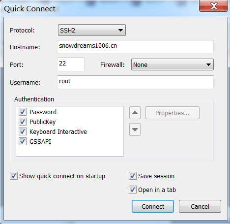
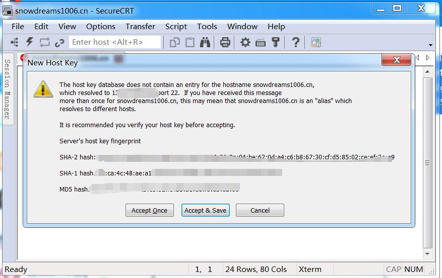
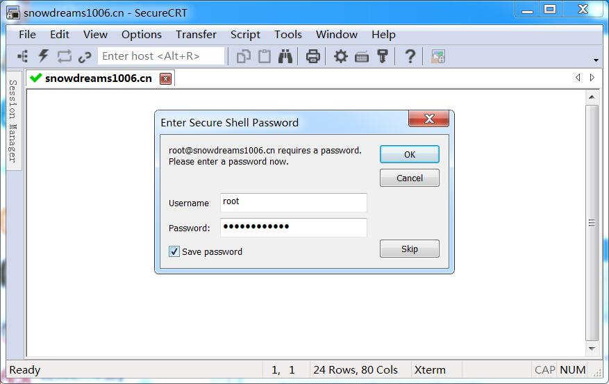
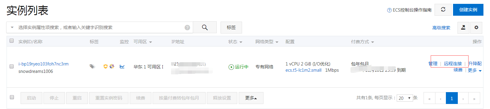

# 登录和登出远程服务器

双 11 期间入手了一台云服务器,备案花了一两个星期,这两天终于备案通过了.于是在个人服务器上装了 `Docker` 容器用于部署项目,准备尽量把所有的服务都打包成容器,方便统一管理运维.

于是利用 `docker` 搭建了 `nginx` 作为反向代理服务器,负责请求分发,用 `nginx` 部署静态博客,用 `mysql` 暴露给个人项目使用...

但是千里之行始于足下,一切还要从登录登出远程服务器开始,本文基于 `Centos7.6` 环境,不保证其他环境正常.

## 环境准备

### 服务器要求

如果你已经有云服务器或者虚拟机服务器,首先需要验证服务器上是否已经安装 `ssh` 服务,如果没有安装则需要提前安装.

登录服务器后,在命令行窗口中输入 `rpm -qa | grep ssh` 查看是否包括 `ssh` 相关文件.

```bash
rpm -qa | grep ssh
```

默认情况下运行 `netstat -antp | grep sshd` 命令,可以看到 `sshd` 服务监听的端口正是默认的 `22` 端口.

```bash
netstat -antp | grep sshd
```

其实一般云服务器均已预装好 `ssh` 服务,如果没有上述输出,则说明可能并没有安装 `ssh` 服务,可以使用 `yum install openssh-server` 进行安装.

下面总结一些关于 `sshd` 的常用命令,如下

- 查看 `sshd` 运行状态

```bash
systemctl status  sshd
```

如果运行结果包括 `Active: active (running)` 则证明 `sshd` 服务处于激活状态,如果是 `Active: inactive (dead)` 则表示服务已关闭.

```bash
systemctl status  sshd
# ● sshd.service - OpenSSH server daemon
#    Loaded: loaded (/usr/lib/systemd/system/sshd.service; enabled; vendor preset: enabled)
#    Active: active (running) since 五 2019-11-29 21:05:08 CST; 16h ago
#      Docs: man:sshd(8)
#            man:sshd_config(5)
#  Main PID: 1051 (sshd)
#     Tasks: 1
#    Memory: 10.9M
#    CGroup: /system.slice/sshd.service
#            └─1051 /usr/sbin/sshd -D
```

- 启动|关闭|重启 `sshd` 服务

```bash
systemctl start  sshd
```

> 针对处于已经关闭 `sshd` 状态时,可以再次启动,如果已经启动,则不会输出结果,但还是启动中.

```bash
systemctl stop  sshd
```

> 针对处于正在运行 `sshd` 状态时,可以停止服务,如果已经停止,则不会输出结果,但还是停止中.

```bash
systemctl restart  sshd
```

> 针对处于正在运行 `sshd` 状态或者已经停止状态时,可以重启服务,虽然都不会输出结果,但已经启动.

- 开机自启|禁止自启 `sshd` 服务

```bash
systemctl list-unit-files | grep enabled
```

> 查看全部开机自启服务,如果包括 `sshd` 则表示 `sshd` 已加入开机自启服务,如果没有则不会开机自启.

```bash
systemctl list-unit-files | grep enabled | grep sshd
```

> 如果全部开机自启服务比较多的话,肉眼不太直接看出 `sshd` 是否自启,在上一条命令的基础上多加一个 `grep sshd` 即可过滤是否包含 `sshd` 服务.

```bash
systemctl enable sshd
```

> 开机自启服务,如果某些服务非常重要需要一直后台运行的话,最好加入开机自启,这样能防止意外关机重启服务器后忘记开启服务,比如 `sshd` 服务和 `docker` 服务等等.

```bash
systemctl disable sshd
```

> 针对已经开机自启服务进行禁用,运行 `systemctl list-unit-files | grep enabled | grep sshd` 可以查看当前服务是否会开机自启.

如果你现在还没有服务器但又想学习体验一下,要么**立即花钱**去买服务器要么**免费安装**虚拟机,或者先收藏起来以后再看!

针对立即购买服务器的小伙伴,请私信联系我,用我的推广链接购买,你有优惠,我有分成,何乐而不为呢?

> [我要购买云服务器](https://webhook.snowdreams1006.cn/hooks/query?title=有人打算购买云服务器啦&body=赶紧去查一下阿里云服务器购买链接私信告诉他/她!),最好还是留言或者私信告诉我!

针对免费安装虚拟机体验的用户,可以根据自己的操作系统,参考以下推文进行安装,有问题也可以联系我!

> [我想安装虚拟机](https://webhook.snowdreams1006.cn/hooks/query?title=有人想要安装虚拟机&body=赶紧去查一下虚拟机安装教程!),最好还是留言或者私信告诉我!

下面是之前推文关于什么是虚拟机以及如何安装 `Centos` 服务器的相关文章,可以点击直接阅读.

- [给你的计算机一种全新的体验](https://mp.weixin.qq.com/s/7_ZxBsxlMoCIr-Qcw1G8Qg)

> 主要介绍了什么是虚拟机以及实例演示如何给 `Windows` 电脑装个 `VMware` 虚拟机.

- [给 windows 虚拟机装个 centos](https://mp.weixin.qq.com/s/7_ZxBsxlMoCIr-Qcw1G8Qg)

> 在 `Windows` 电脑已经装好 `VMware`虚拟机的基础上,装个 `Centos` 镜像就拥有了自己的 `Centos` 服务器.

- [工具资源系列之给mac装个虚拟机](https://mp.weixin.qq.com/s/ToXjx06xlehHpsCcfOWliw)

> 主要介绍了什么是虚拟机以及实例演示如何给 `Mac` 电脑装个 `VMware` 虚拟机.

- [工具资源系列之给虚拟机装个centos](https://mp.weixin.qq.com/s/D1Fdpp2vcBnX0eVbMzPV1A)

> 在 `Mac` 电脑已经装好 `VMware`虚拟机的基础上,装个 `Centos` 镜像就拥有了自己的 `Centos` 服务器.

### 客户端要求

因为登录服务器需要使用到 `ssh` 协议,所以首先需要验证本机客户端命令行是否支持 `ssh` 协议.

打开你正在使用的命令行,直接输入 `ssh` 如果有下列提示证明是可以的,如果没有请安装支持 `ssh` 协议命令行终端.

如果你是 `Mac` 用户,打开默认的 `terminal` 终端输入 `ssh` 返回用法说明,证明是支持 `ssh` 协议的.

```bash
ssh
# usage: ssh [-46AaCfGgKkMNnqsTtVvXxYy] [-B bind_interface]
#            [-b bind_address] [-c cipher_spec] [-D [bind_address:]port]
#            [-E log_file] [-e escape_char] [-F configfile] [-I pkcs11]
#            [-i identity_file] [-J [user@]host[:port]] [-L address]
#            [-l login_name] [-m mac_spec] [-O ctl_cmd] [-o option] [-p port]
#            [-Q query_option] [-R address] [-S ctl_path] [-W host:port]
#            [-w local_tun[:remote_tun]] destination [command]
```

> `Mac` 自带的 `terminal` 终端是支持 `ssh` 协议的,`Windows` 的 `Git Bash` 命令行也是支持的!

如果你是 `Windows` 用户正在使用 `cmd` 命令行窗口,很遗憾并不支持 `ssh` 协议,请自行选择类 `unix` 终端进行操作.

```cmd
Microsoft Windows [版本 6.1.7601]
版权所有 (c) 2009 Microsoft Corporation。保留所有权利。

C:\Users\Administrator>ssh
'ssh' 不是内部或外部命令，也不是可运行的程序
或批处理文件。

C:\Users\Administrator>
```

> `Windows` 用户不妨安装 [Git for Windows](https://git-scm.com/download/win) ,默认自带的 `Git Bash` 命令行就很好用,比 `cmd` 终端更加简单优雅,给你一种类 `unix` 操作体验.

## 命令行登录

`ssh` 登录服务器前提是知道账号密码,先用密码登录的方式进行设置,然后才能用 `ssh` 方式进行免密登录.

一般情况下,密码都是自己设置的,如果不清楚默认密码是多少可以询问云服务器厂商或者选择重设密码,这里不再赘述,假设你已经知道服务器密码并且知道服务器公网 ip.

下面我们将会在本机客户端的命令行中远程登录云服务器,从最简单方便的密码登录到无密码的密钥登录再到最后的别名登录,快点跟着我一起动起来吧!

> 友情提示: 请确保服务端已开启 `sshd` 服务和本地客户端命令行中支持 `ssh` 协议,否则还是先收藏起来以后再看吧!

### 密码登录 

打开熟悉的命令行终端,运行 `ssh <登录账号>@<服务器公网 ip>` 命令直接登录远程云服务器.

```bash
$ ssh root@snowdreams1006.cn
@@@@@@@@@@@@@@@@@@@@@@@@@@@@@@@@@@@@@@@@@@@@@@@@@@@@@@@@@@@
@    WARNING: REMOTE HOST IDENTIFICATION HAS CHANGED!     @
@@@@@@@@@@@@@@@@@@@@@@@@@@@@@@@@@@@@@@@@@@@@@@@@@@@@@@@@@@@
IT IS POSSIBLE THAT SOMEONE IS DOING SOMETHING NASTY!
Someone could be eavesdropping on you right now (man-in-the-middle attack)!
It is also possible that a host key has just been changed.
The fingerprint for the ECDSA key sent by the remote host is
SHA256:/RJ5aI+c41Brr1dcBMhdNHQJa7daP+8fbupqsGmHRHc.
Please contact your system administrator.
Add correct host key in /c/Users/Administrator/.ssh/known_hosts to get rid of this message.
Offending ECDSA key in /c/Users/Administrator/.ssh/known_hosts:5
ECDSA host key for 121.40.223.69 has changed and you have requested strict checking.
Host key verification failed.
```

> 因为我的域名 `snowdreams1006.cn` 已经**备案**成功并且做了**域名解析**,所以这里我可以直接用域名而不是 `ip`,说白了还是因为懒,谁让 `ip` 记不住呢!

如果你没有遇到上述提示,恭喜你,可以接着输入账号密码就可以登录到服务器了!

如果你和我一样遇到这种问题,很可能是之前登陆过服务器,不过后来服务器又重装系统,导致无法登录,可以清除本机 `~/.ssh/known_hosts` 重新登录.

```bash
rm -rf ~/.ssh/known_hosts
```

强制删除 `~/.ssh/known_hosts` 文件后重新 `ssh root@snowdreams1006.cn` 登录到远程云服务器,按照提示选择继续连接 `yes` ,然后输入自己的密码 `password` ,登录成功后默认进入到家目录.

```bash
ssh root@snowdreams1006.cn
# The authenticity of host 'snowdreams1006.cn (*.*.*.*)' can't be established.
# ECDSA key fingerprint is SHA256:/**********************************.
# Are you sure you want to continue connecting (yes/no)? yes
# Warning: Permanently added 'snowdreams1006.cn,*.*.*.*' (ECDSA) to the list of known hosts.
# root@snowdreams1006.cn's password:
# Last login: *** from *.*.*.*

# Welcome to Alibaba Cloud Elastic Compute Service !
```

来都来了,不留下点什么东西不好不意思跟别人说过自己曾将来过,那就随便意思意思好了.

- 悟空到此一游

```bash
whoami
# root
```

> `whoami` 我是谁: 查看正在登录用户名称

```bash
pwd
# /root
```

> `pwd` 我在哪: 打印当前目录路径

```bash
who -u
# root     tty1         2019-11-29 21:05  旧的         596
# root     pts/0        2019-11-30 14:15   .         17506 (115.217.243.122)
# root     pts/1        2019-11-30 14:28 00:05       17533 (115.217.243.122)
```

> `who -u`  还有谁: 打印系统登录用户

```bash
last -a | head -6
# root     pts/1        Sat Nov 30 14:28   still logged in    115.217.243.122
# root     pts/0        Sat Nov 30 14:15   still logged in    115.217.243.122
# root     pts/0        Sat Nov 30 13:10 - 13:51  (00:41)     115.217.243.122
# root     pts/0        Sat Nov 30 12:24 - 12:25  (00:00)     115.217.243.122
# root     pts/1        Fri Nov 29 22:08 - 23:12  (01:03)     112.17.241.55
# root     pts/0        Fri Nov 29 21:33 - 22:13  (00:39)     112.17.241.55
```

> `last -a | head -6`  最后是谁: 打印最后登录用户

- 好像不认识你

如果发现登录用户除了自己还有别人或者不记得自己其他终端登陆过没有退出,这时候应该踢出这些登录终端.

如果要踢出别人,首先要自己登录的终端终端中哪个是自己,不能自己把自己踢了,那就好笑了!

`whoami` 仅仅打印登录名,没有登录终端信息,但是 `who am i` 展示信息就相对多了,这里要记住当前用户登录终端的名称!

```bash
who am i
# root     pts/0        *** (*.*.*.*)
```

> `who am i` : 我是谁,比 `whoami` 显示的信息更多.

`who -u` 可以展示全部登录用户,不过这里推荐使用 `w` 查看登录用户终端信息,因为敲入的命令更少!

```bash
w
#  14:53:04 up 17:48,  3 users,  load average: 0.00, 0.01, 0.05
# USER     TTY      FROM             LOGIN@   IDLE   JCPU   PCPU WHAT
# root     tty1                      五21   17:46m  0.00s  0.00s -bash
# root     pts/0    115.217.243.122  14:15    0.00s  0.81s  0.00s w
# root     pts/1    115.217.243.122  14:51    1:37   0.00s  0.00s -bash
```

> `who -u` 和 `w` 都可以查看登录用户终端信息,`pts/0` 是当前登录终端,其他终端 `pts/1` 就可以被踢掉了.

```bash
# pkill -kill -t pts/1
```

> `pkill -kill -t pts/<序号>` 踢出登录终端后,被踢出的终端则会自动退出显示连接已关闭.

```bash
w
#  14:58:46 up 17:53,  2 users,  load average: 0.00, 0.01, 0.05
# USER     TTY      FROM             LOGIN@   IDLE   JCPU   PCPU WHAT
# root     tty1                      五21   17:52m  0.00s  0.00s -bash
# root     pts/0    115.217.243.122  14:15    6.00s  0.83s  0.00s w
```

> `w` : 有谁,踢出其他终端后再次查看登录终端发现确实没有 `pts/1` 了,证明操作成功!

- 回家洗洗睡吧

登录到服务器查看了一些信息,并成功踢出了其他终端,天已经黑了,是时候洗洗睡了,这时候需要退出服务器回到本地客户端的命令行.

```bash
exit
# 登出
# Connection to ssh.snowdreams1006.cn closed.
```

> 除了敲入命令 `exit` 还可以敲入快捷键 `Ctrl+D` 退出连接.

### 密钥登录

一般来说,使用密码登录的方式更加适合不常用的场合,偶尔用终端登录一下没什么问题,如果是经常性需要登录到远程服务器的话,每次连接都需要登录就比较费事了.

既然不用密码登录,那怎么证明自己的身份以保证合法性登录请求呢?

这里就要用到密钥代替密码进行登录,首先在本机客户端生成一种认证信息,然后将这种认证信息安装到远程服务器中,只要完成这种操作就意味着下一次来自该客户端的登录请求都是合法的,不然服务端怎么会有你的认证信息?

所以,可以猜想的是,即使是相同的账号,如果使用的是不同的认证信息,那么远程服务器还是会已保存的认证信息为准,比如你的 `Mac` 已经实现免密登录,但是你的 `Windows` 由于并没有上传自己的认证信息,所以免密登录只对 `Mac` 有效!

当然,如果 `Mac` 和 `Windows` 电脑的认证信息是一样的,那么服务器保存一份是不是可以免密登录了呢?

答案是: 正确的!

由此可见,密钥登录是针对终端设备而言的,特别适合常用的终端,偶尔性的电脑前往不要设置密钥,不然哪天你忘记了,人家都能直接登录你的服务器,多可怕!

所以,要完成免密登录,需要两个操作,一是本地客户端生成认证文件,二是远程服务器保存该认证文件.

1. 本地客户端生成公钥

```bash
cat ~/.ssh/id_rsa.pub
```

> `~/.ssh/id_rsa.pub` 文件被称为公钥,即用于发送给服务器的认证文件,可以公开到互联网,只要服务器保存该公钥,那么生成该公钥的本地客户端就能免密连接到服务器.

如果你的本地客户端没有该文件,可以使用 `ssh-keygen -t rsa` 生成一份,按照提示输入相关的信息即可,然后再次运行 `cat ~/.ssh/id_rsa.pub` 就能查看公钥文件的具体内容了.

2. 远程服务器接收公钥

本地客户端将自己的公钥文件内容追加到远程服务器的授权文件中就能完成免密登录,那么问题来了,公钥文件保存在哪呢?

答案是: `~/.ssh/authorized_keys`

```bash
cat ~/.ssh/authorized_keys 
```

这里可以看出,远程服务器的 `~/.ssh/authorized_keys` 内容包含了本地客户端的 `~/.ssh/id_rsa.pub` 公钥内容.

所以接下来的动作就是复制粘贴的操作,复制本地客户端的 `~/.ssh/id_rsa.pub` 公钥文件内容,粘贴到远程服务器的 `~/.ssh/authorized_keys` 文件中.

只不过这里需要用到 `vim` 操作,这也是对于新手来说唯一的挑战了,但是我们还有神器来简化这种复制粘贴操作!

那就是: `ssh-copy-id root@snowdreams1006.cn`

首先确保本地客户端已经生成公钥,这里查看一下公钥文件的内容: `cat ~/.ssh/id_rsa.pub`

```bash
cat ~/.ssh/id_rsa.pub
```

这里是 `Windows` 电脑,演示前并没有配置免密登录,所以执行完 `ssh-copy-id root@snowdreams1006.cn` 应该也像 `Mac` 电脑一样支持免密登录.

```bash
ssh-copy-id root@snowdreams1006.cn
# /usr/bin/ssh-copy-id: INFO: Source of key(s) to be installed: "/c/Users/Administrator/.ssh/id_rsa.pub"
# /usr/bin/ssh-copy-id: INFO: attempting to log in with the new key(s), to filter out any that are already installed
# /usr/bin/ssh-copy-id: INFO: 1 key(s) remain to be installed -- if you are prompted now it is to install the new keys
# root@snowdreams1006.cn's password:

# Number of key(s) added: 1

# Now try logging into the machine, with:   "ssh 'root@snowdreams1006.cn'"
# and check to make sure that only the key(s) you wanted were added.
```

这里接着用已经免密登录到远程服务器的 `Mac` 电脑验证一下,`Windows` 电脑的公钥是否已经添加到远程服务器的 `~/.ssh/authorized_keys` .

```bash
cat ~/.ssh/authorized_keys 
```

可以看到,远程服务器已经保存了 `Windows` 电脑刚刚上传的公钥文件内容,所以说 `ssh-copy-id` 简直就是神器,再也不用手动复制粘贴公钥了!

至于登陆后可以做什么,我想你还是可以到此一游,顺便再踢出其他终端之类的,最后别忘了退出登录 `exit` 命令哟!

### 别名登录

无论是密码登录还是密钥登录,我们都是采用 `ssh` 协议进行登录,而密钥登录的配置也是依赖于密码登录,不管怎么说,两者敲入的命令都不少!

怎不能快速登录呢?

答案是: 可以的!

既然想要快速登录,但是登录信息肯定是必不可少的,所以无外乎是将必要的登录信息写到配置文件中,登录时再读取配置文件进行登录.

原理很好理解,关键是实现过程需要我们自己去实现么?

幸运的是: 不需要!

同样地,编辑 `ssh` 的配置文件设置一些登录信息即可,配置文件的位于 `~/.ssh/config` .

```bash
Host <主机 id>
User <登录账号>
HostName <主机名称>
```

按照上述格式,将登录信息配置如下:

```bash
Host github.com
User snowdreams1006
Hostname ssh.github.com

Host snowdreams1006.cn
User root
Hostname ssh.snowdreams1006.cn
```

其中 `Host` 是对外暴露的唯一标识,通过 `Host` 就可以代替账号和 ip 了,两个变成一个是不是简化了呢?

原来的登录命令是 `ssh <登录账号>@<服务器公网 ip>` 而现在则是 `ssh <主机 id>`

```bash
ssh snowdreams1006.cn
# Last login: **** from *.*.*.*

# Welcome to Alibaba Cloud Elastic Compute Service !
```

## 图形化登录

推荐 `SecureCRT` 图形化工具远程连接 `Linux`  实例,图形化工具基本上很容易上手,配置一下就可以登录成功了,这里已 `Windows` 电脑为例演示一下相关过程.

首次登录后会弹出快速连接配置,基本上是关于服务域名端口之类的,并没有密码的配置项.



点击连接后会弹出是否加入主机指纹之类的,选择接受并保存.



输入密码后选择确定,过一会就连接到服务器了.



来都来了,还是随便敲个命令再走吧!


## 云服务登录

登录控制台找到 `ECS 服务器` ,然后找到自己的云服务器,因此远程连接->连接密码->用户名/密码,然后就可以登录成功了!



## 回顾总结

密码登录和密钥登录两者均存在适合场景,如果觉得密码登录不安全的话,也可以禁用密码登录只保留密钥登录!

远程登录到服务器,找到 `/etc/ssh/ssh_config` 文件并编辑如下内容来禁用密码登录.

```bash
Host *
  PasswordAuthentication no
```

- 密码登录

```bash
ssh <登录账号>@<服务器公网 ip>
```

> `ssh root@snowdreams1006.cn`

- 密钥登录

```bash
ssh <登录账号>@<服务器公网 ip>
```

> `ssh root@snowdreams1006.cn`

- 简化登录

```bash
ssh <主机 id>
```

> `ssh snowdreams1006.cn`

## 阅读更多

- [CentOS下开启SSH Server服务](https://www.cnblogs.com/DiDiao-Liang/articles/8283686.html)
- [linux 远程连接ssh提示IT IS POSSIBLE THAT SOMEONE IS DOING SOMETHING NASTY解决](https://blog.csdn.net/watsy/article/details/12611919)
- [Linux 7开机自启项查看并设置](https://www.cnblogs.com/Cherry-Linux/p/11129334.html)
- [SSH简介及两种远程登录的方法](https://blog.csdn.net/li528405176/article/details/82810342)
- [服务器快速免密ssh登录配置](https://juejin.im/post/5da724506fb9a04e2a73d96c)
- [linux 信息查看及命令](https://juejin.im/post/5dad7681f265da5bb86ad2f5)
- [linux下踢出已登录用户](https://blog.csdn.net/wzzfeitian/article/details/9321027)
- [Mac安装SecureCRT](https://www.jianshu.com/p/983f2f226579)
- [SecureCRT 8.1.4 破解教程](https://www.jianshu.com/p/2bfd1fbf31bc)
